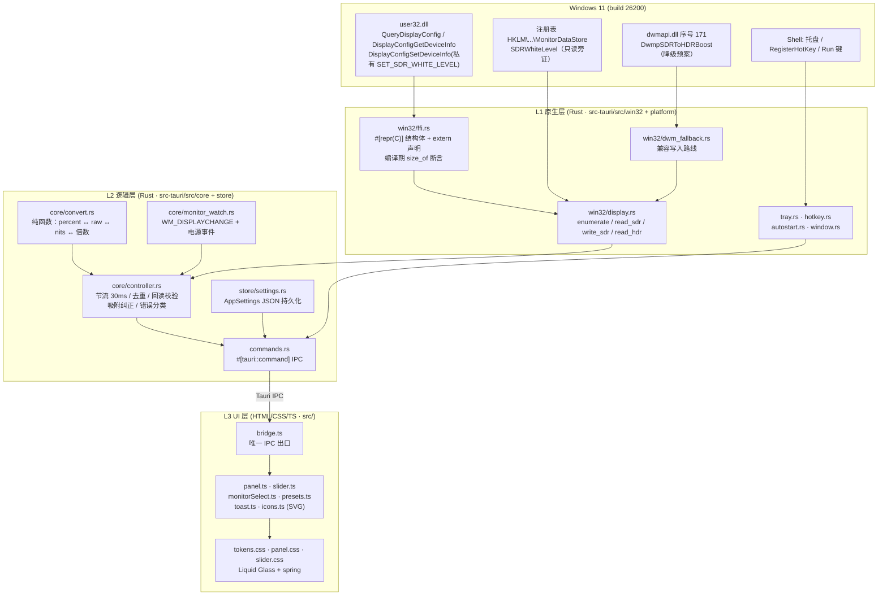
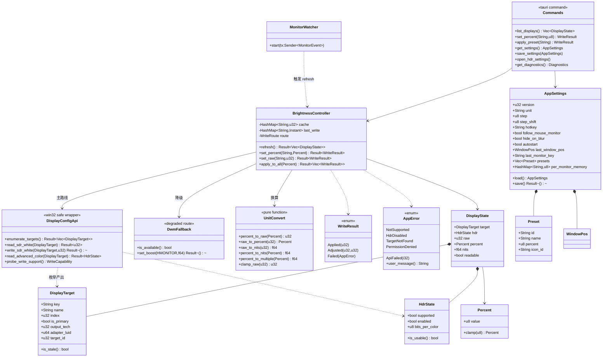
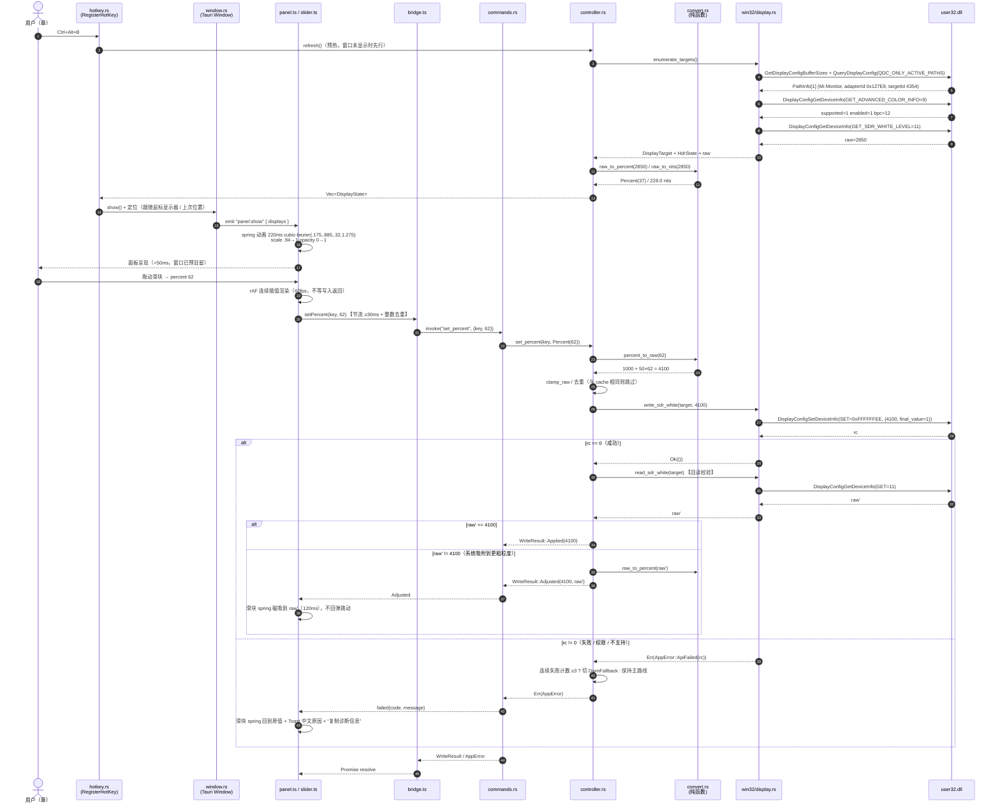
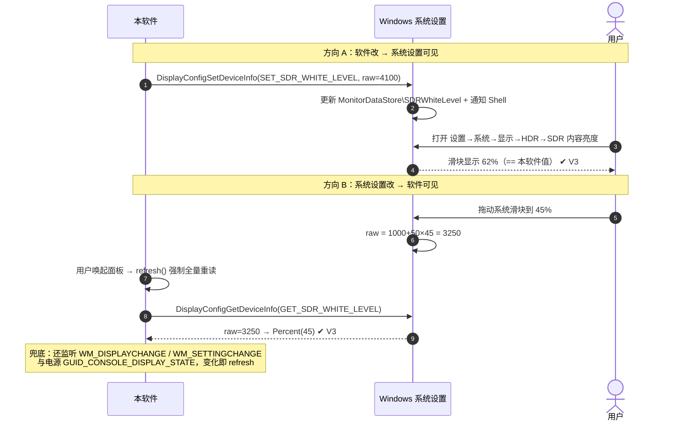
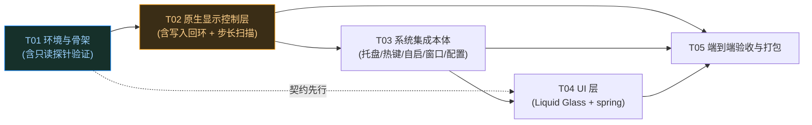

# 系统架构设计 + 任务分解：HDR「SDR 内容亮度」悬浮控制器

| 项目信息 | 内容 |
| --- | --- |
| 文档类型 | 系统架构设计 / 任务分解（**仅计划，不含实现代码**） |
| 项目名 | `hdr_sdr_widget` |
| PRD 依据 | `docs/hdr-sdr-widget/PRD.md` |
| 目标平台 | Windows 11 build **26200**（25H2） |
| 目标机器 | i5-14600K / RTX 3070 / 32G / HDR 显示器 `Mi Monitor` |
| 文档状态 | 已实现 |

---

## 0. 执行摘要（先看这段）

| 项 | 结论 |
| --- | --- |
| 首选技术栈 | **Tauri 2（Rust 后端 + WebView2 前端）**，UI 用零框架原生 HTML/CSS/TS |
| 一句话理由 | CSS 能 100% 还原 Apple Liquid Glass 与 spring 曲线，Rust 能完全掌控 Win32 私有结构体的内存布局，产物仅 3–8MB、常驻内存 45–80MB，托盘/全局热键/自启有官方插件 |
| 兜底栈 | **.NET 10 WPF 原生 XAML**（本机 SDK 10.0.100 + WindowsDesktop.App.Ref 已就位，**零安装**） |
| 预估源文件 | **26 个源码文件 + 8 个配置/构建文件 + 2 个验证脚本** |
| 建议工作流 | **标准 SOP**（>10 源文件） |
| 任务总数 | **5 个里程碑任务（T01–T05），共 21 个子步骤** |
| 最大技术风险 | **写入私有 API `SET_SDR_WHITE_LEVEL` 的取值粒度/对齐未知**，可能导致拖动跳动或回弹（详见第 9 节 R2，第 10 节 V6 有专门的扫描验证） |
| 换算公式（已交叉验证锁定） | `nits = 80 + 4 × percent`；`raw = 12.5 × nits = 1000 + 50 × percent`；`percent = (raw − 1000) / 50` |
| 关键发现 1 | 侦察表 **30% 与 55% 两行的 raw 列是笔误**（应为 2500 / 3750），percent↔nits 列完全自洽，且被本机 `raw=2850 → 37%` 精确验证 |
| 关键发现 2 | Win32 结构体尺寸经实测复核：`PathInfo=72 / ModeInfo=64 / SDR_WHITE_LEVEL=24 / ADVANCED_COLOR_INFO=32 / TARGET_DEVICE_NAME=420`，实现时无需推测 padding |

---

## 1. 技术选型与理由

### 1.1 候选方案对比

| 维度 | **A. Tauri 2**<br>Rust + WebView2 | B. Electron + koffi | **C. .NET10 WPF 原生** | D. WPF 壳 + WebView2 | E. Python + PySide6 | F. C++ + WebView2 |
| --- | --- | --- | --- | --- | --- | --- |
| **Apple UI 还原度**<br>(毛玻璃+spring) | ★★★★★<br>CSS `backdrop-filter` + OS acrylic **双保险**，spring 曲线 1 行 CSS | ★★★★★<br>同左 | ★★★☆☆<br>需自写 `CubicBezierEase`/`BackEase`；毛玻璃靠 `SetWindowCompositionAttribute` hack | ★★★★☆<br>同 A，但透明窗口 + WebView2 有空气域风险 | ★★★☆☆<br>QSS/QML 难以达到 Apple 精度 | ★★★★☆<br>同 A，但托盘/热键全手写 |
| **本机工具链可用性** | ⚠️ **需装 rustup**<br>（可下载：HTTP 200 / 0.9s） | ✅ 零安装<br>（`npm i electron` ≈100MB） | ✅ **零安装**<br>SDK 10.0.100 + WinDesktop.Ref 10.0.0 已就位 | ✅ 零安装<br>+WebView2 NuGet | ❌ 需 pip 装 PySide6(≈150MB)+PyInstaller | ✅ MSVC 14.44 + WinSDK 26100 已就位 |
| **产物体积** | 🟢 **3–8 MB** | 🔴 180–250 MB | 🟢 0.2MB / 70MB(自包含) | 🟡 5MB / 80MB | 🔴 40–80 MB | 🟢 1–3 MB |
| **冷启动 / 唤起延迟** | 250–500ms / **<50ms**（隐藏式预驻留） | 900–1500ms / ~80ms | 🟢 150–350ms / **<30ms** | 400–700ms / <50ms | 800–1200ms / ~150ms | 🟢 <100ms / <20ms |
| **常驻内存** | 🟢 **45–80 MB** | 🔴 250–400 MB | 🟢 **40–70 MB** | 🟡 90–140 MB | 🟡 90–160 MB | 🟢 15–35 MB |
| **调 Win32 私有 API** | 🟢 极易<br>`#[repr(C)]` 完全掌控布局 | 🟢 易<br>koffi 定义 struct，免编译 | 🟢 易<br>`[StructLayout(Sequential)]` | 🟢 易 | 🟡 中<br>ctypes 已验证可行，打包易被杀软误报 | 🟢 极易 |
| **托盘/热键/自启生态** | 🟢 官方插件齐全 | 🟢 官方 API 齐全 | 🟡 部分需 P/Invoke（托盘可用 WinForms `NotifyIcon`） | 🟡 同 C | 🔴 需 pystray / keyboard 三方依赖 | 🔴 全部手写（最累） |
| **打包分发** | 🟢 `tauri build` 直出 MSI/NSIS | 🟡 electron-builder（慢但成熟） | 🟢 `dotnet publish` 单文件 | 🟢 同 C + WebView2 引导 | 🔴 PyInstaller（体积/误报） | 🔴 需 CMake + 签名 |
| **开发与迭代效率** | 🟡 中<br>Rust 首编 5–8min，增量 5–20s；**CSS 热更新秒级** | 🟢 高 | 🟢 中高<br>C# 编译快，XAML 热重载可用 | 🟢 中高 | 🟢 高（打包坑） | 🔴 低 |

### 1.2 决策

> **首选：方案 A — Tauri 2（Rust + WebView2 + 零框架原生 HTML/CSS/TS）**

**理由（按权重排序）**

1. **UI 还原度是本项目第一验收项**（用户对质感要求极高）。CSS 的 `backdrop-filter: blur(28px) saturate(160%)` + `cubic-bezier(0.175,0.885,0.32,1.275)` 与 PRD §4.5 的色值表是 1:1 映射，改一个变量即见效；Tauri 还支持 `windowEffects: "acrylic"|"mica"`，可叠加真实 OS 级毛玻璃，做成"OS 模糊打底 + CSS 高光/描边/饱和叠加"的双层质感，这是 WPF 原生很难做到的。
2. **私有 API 调用最可控**。写入用的是 undocumented 结构体，内存布局错 1 字节就 `ERROR_INVALID_PARAMETER`。Rust 的 `#[repr(C)]` + 编译期 `size_of` 断言可以在**编译期**拦住布局错误，比运行时猜错强一个量级。
3. **体积与内存的量级优势**：3–8MB / 45–80MB vs Electron 200MB / 300MB。对"常驻托盘的小工具"这个定位，差距是决定性的。
4. **生态完备**：`tauri-plugin-global-shortcut` / `tray-icon` / `autostart` / `single-instance` / `store` 均为官方维护，省掉大量 P/Invoke 手写。
5. **本机唯一缺口（Rust）可低成本补齐**：MSVC 14.44 + WinSDK 26100 已在（Tauri 的全部其他前置依赖），rustup 下载 200/0.9s 通畅，磁盘余 55GB 够用。

> **兜底：方案 C — .NET 10 WPF 原生 XAML（零安装）**

**切换条件（满足任一即切换）**

| # | 切换条件 | 判定方式 |
| --- | --- | --- |
| S1 | `rustup-init` 下载失败或 15 分钟内未安装完成 | 安装计时 |
| S2 | `cargo build` 因网络（crates.io 拉取失败）或 MSVC 链接错误，**30 分钟内无法打通** | 首次构建计时 |
| S3 | 用户（章）明确拒绝安装 2–3GB 的 Rust 工具链 | 第 11 节 Q15 |

> **第三预案：方案 B — Electron + koffi**

仅当 A 与 C 双双不可行时启用。**可逆性设计保障**：无论 A/B/D 走哪条，UI 层统一为「零框架原生 HTML/CSS/TS + 一层薄 `bridge.ts` 抽象」，迁移时 UI 资产几乎零改动，只换 `bridge` 实现。

> **为什么排除 E（Python）**：PySide6 需额外 150MB 安装，PyInstaller 打包体积大、杀软误报率高，冷启动 800ms+ 与"≤300ms 唤起"目标冲突。Python 的**唯一角色是验证工具**（`tools/probe_read.py` / `probe_write.py`），ctypes 路线已由齐活林跑通，成本为零。

> **为什么排除 F（C++）**：托盘、全局热键、自启、DPI 全部需手写 Win32，开发效率最低，与"快速出可用产品"冲突。**降级时其思路（直接 C ABI）已包含在 Rust 的 `win32/ffi.rs` 中。**

### 1.3 分层与职责

| 层 | 技术 | 职责 | 关键点 |
| --- | --- | --- | --- |
| **L1 原生层** | Rust + `windows` crate | Win32 DisplayConfig API 调用、结构体内存布局、注册表只读诊断、托盘/热键/自启/窗口 | 全部 unsafe 收敛在 `win32/` 一个目录；对外暴露 safe API |
| **L2 逻辑层** | Rust | 单位换算（纯函数）、读写编排（节流/去重/回读校验）、错误分类、配置持久化、显示变化监听 | 不依赖任何 UI；可独立被 `tools/` 与测试驱动 |
| **L3 UI 层** | HTML + CSS + TS（无框架） | 面板渲染、spring 动效、SVG 图标、交互 | 只通过 `bridge.ts` 调 L2 的 IPC 命令，**不碰任何 Win32** |

**硬约束：L3 不得直接调用任何 Win32 API。** 保证 UI 资产在 A/B/D 三方案间可移植。

---

## 2. 环境检测结论

> 全部命令于本机实际执行，非推断。

### 2.1 工具链

| 项 | 状态 | 实测值 / 路径 | 影响 |
| --- | --- | --- | --- |
| 操作系统 | ✅ | `MINGW64_NT-10.0-26200`（**Windows 11 25H2**） | HDR/DisplayConfig API 全部可用 |
| **Rust / cargo** | ❌ **缺失** | — | **唯一阻塞项**，`winget install Rustlang.Rustup` 或 rustup-init |
| MSVC 生成工具 | ✅ | `C:\Program Files (x86)\Microsoft Visual Studio\2022\BuildTools\VC\Tools\MSVC\14.44.35207\bin\Hostx64\x64\cl.exe` | Tauri / C++ 方案免安装 |
| `vcvarsall.bat` | ✅ | `...\2022\BuildTools\VC\Auxiliary\Build\vcvarsall.bat` | 构建时需先 source |
| Windows SDK | ✅ | `10.0.26100.0`（另有 14393/15063/16299/17134） | Win32 头文件齐备 |
| .NET SDK | ✅ | `10.0.100` | 兜底方案 C 零安装可用 |
| .NET WindowsDesktop Ref | ✅ | `C:\Program Files\dotnet\packs\Microsoft.WindowsDesktop.App.Ref\10.0.0` | **WPF/WinForms 可直接建，无需额外 workload** |
| .NET WindowsDesktop 运行时 | ✅ | 6.0.36 / 7.0.20 / 8.0.11 / 10.0.0 | — |
| Node.js | ✅ | `v22.22.2`（`C:\Users\dfqaz\.workbuddy\binaries\node\versions\22.22.2\node`） | 前端构建 |
| npm | ✅ | `10.9.7` | — |
| Python | ✅ | `3.13.14`（managed）；已装 numpy 2.5.2 / pillow 12.3.0；**无 pywin32、无 PySide** | 验证脚本用（ctypes 内置，够用） |
| WebView2 Runtime | ✅ | `C:\Program Files (x86)\Microsoft\EdgeWebView\Application\151.0.4129.107` | Tauri/Electron/WPF-WebView2 全部免安装 |
| Microsoft Edge | ✅ | 151.0.4129.107 / 152.0.4191.53 | — |
| winget | ✅ | `C:\Users\dfqaz\AppData\Local\Microsoft\WindowsApps\winget.exe` | 装 Rust 用 |
| cmake | ✅ | 4.3.2（WinLibs） | C++ 预案用 |
| git | ✅ | 2.54.0 | 版本管理 |
| **磁盘** | ⚠️ | `C: 400G 总 / 345G 已用 / **55G 可用 (87%)**` | 装 Rust ≈2.5GB 够用；**建议 `CARGO_TARGET_DIR` 指到 D 盘**避免 C 盘告急 |
| 网络 rustup | ✅ | `static.rust-lang.org` HTTP 200 / 0.91s | — |
| 网络 crates.io | ✅ | HTTP 200 / 2.38s | — |
| 网络 npm | ✅ | HTTP 200 / 4.18s | — |
| 网络 pypi | ✅ | HTTP 200 / 1.06s | — |

### 2.2 显示器实测（我独立跑的只读探针，复核齐活林结论）

```
sizeof PathInfo=72  ModeInfo=64  SDR_WHITE_LEVEL=24  ADVANCED_COLOR_INFO=32  TARGET_DEVICE_NAME=420
GetDisplayConfigBufferSizes rc=0 paths=1 modes=2
QueryDisplayConfig          rc=0 paths=1 modes=2

--- path 0 ---
  adapterId = 0x00000000_000127E9   targetId = 4354   available = 1   outputTech = 5 (DisplayPort External?)
  advancedColor: rc=0  value=0x03  supported=1  enabled=1  wideColorEnforced=0  bitsPerColorChannel=12
  sdrWhiteLevel: rc=0  raw=2850  nits=228.0  percent=37.0
  friendlyName: 'Mi Monitor'
  devicePath  : '\\?\DISPLAY#XMI3009#5&1e5a718c&0&UID4354#{e6f07b5f-ee97-4a90-b076-33f57bf4eaa7}'
```

**结论**

| # | 结论 | 工程含义 |
| --- | --- | --- |
| C1 | 结构体尺寸实测锁定（72/64/24/32/420） | Rust 侧加 `const _: () = assert!(size_of::<T>() == N);` 编译期断言，布局出错立即编译失败 |
| C2 | `raw=2850` → `percent = (2850−1000)/50 = 37.0` **整数闭合** | **换算公式被本机实测精确验证**，非推断 |
| C3 | 仅 1 条活动路径 → 当前单显示器 | 多显示器按 N 台设计与编码，但**实测只能覆盖 N=1 路径**；第 10 节 V7 说明如何补测 |
| C4 | `monitorDevicePath` = `DISPLAY#XMI3009#5&1e5a718c&0&UID4354#...` | 作为**跨会话稳定标识**；`adapterId+targetId` 视为**易失句柄**，每次调用前重新解析 |
| C5 | 该路径同时是注册表 `MonitorDataStore\<实例ID>\SDRWhiteLevel` 的键名来源 | 可用于 V4 旁证与诊断面板 |

### 2.3 缺失项安装方式

| 缺失项 | 安装命令 | 预计耗时 | 备注 |
| --- | --- | --- | --- |
| Rust 工具链（首选方案必需） | `winget install -e --id Rustlang.Rustup`（装完重开终端）→ `rustup default stable-x86_64-pc-windows-msvc` | 5–10 min / ≈2.5GB | 前置 MSVC 已就位；需重启终端刷新 PATH |
| （可选）WebView2 SDK | `winget install -e --id Microsoft.Edge.WebView2` | <1 min | 运行时已在，通常无需安装 |
| （兜底方案无需安装） | — | — | .NET 10 + WinDesktop Ref 已就位 |

---

## 3. 系统架构

### 3.1 架构图



### 3.2 分层说明

| 层 | 边界规则 | 为什么这么切 |
| --- | --- | --- |
| **L1 原生层** | 所有 `unsafe`、所有 `extern "system"`、所有 HANDLE 只出现在这里；对外只暴露 safe 函数 | 私有 API 是最易出错的部分，把风险关进一个笼子；降级路线切换只改这里 |
| **L2 逻辑层** | 不引用任何 `win32` 的 unsafe 细节，只依赖 L1 的 safe 接口；**纯函数可单测** | 换算、节流、回读校验是本项目最容易出 bug 的业务逻辑，必须能脱离 UI 与硬件测试 |
| **L3 UI 层** | 只通过 `bridge.ts` 调 `#[tauri::command]`；**禁止任何 Win32/Node/Rust 直调** | 保证 UI 资产在 Tauri / Electron / WPF+WebView2 之间可移植（可逆性设计） |

### 3.3 关键技术决策

| # | 决策 | 理由 |
| --- | --- | --- |
| D1 | **内部唯一真值 = 整数 `percent ∈ [0,100]`**（不是 raw，不是 nits） | 与系统滑块口径一致；天然满足 50 步长对齐（raw = 1000+50p 必为 50 的倍数），一步解决"步长/对齐"隐患 |
| D2 | 显示器**稳定标识用 `monitorDevicePath`**，`adapterId+targetId` 每次调用前重新解析 | 休眠唤醒/拔插后 targetId 会变；用设备实例 ID 才能保住"上次选中的显示器"与"每显示器记忆值" |
| D3 | 窗口**隐藏而非销毁**（点 ✕ / 失焦 → `hide()`） | 唤起延迟从 250ms 降到 <50ms，满足 G1；同时保住 WebView2 已初始化的状态 |
| D4 | 拖动：**UI 连续插值 + 写入节流** | UI 用 rAF/CSS 连续渲染 60fps；写入层按"整数 percent 变化 + ≥30ms 间隔"去重发送；两者解耦 |
| D5 | 回读不符时**平滑吸附**到系统实际值，而非回弹 | 若系统把值吸附到更粗粒度，"磁吸"手感远优于"跳动回弹" |
| D6 | 每次写入后**异步回读校验**，并在面板打开/显示器切换/收到显示变化消息时**强制全量刷新** | 保证 P0-8「与系统一致」与双向同步 |
| D7 | 自启用**注册表 `HKCU\...\Run`**（非任务计划程序） | 无需管理员权限、无触发器延迟、可被任务管理器直接显示启用/禁用状态（PRD P1-4 验收要求） |
| D8 | 全局快捷键用 `RegisterHotKey`；**注册前先试注册并捕获冲突**，失败时在 UI 明确提示 | PRD P0-2 要求冲突可感知 |
| D9 | UI 层**零前端框架**（原生 TS + CSS 变量） | 26 个文件里 UI 只占 11 个，引入 React/Vue 是过度工程；也符合用户对"单文件/轻量"的偏好 |
| D10 | `CARGO_TARGET_DIR` 指向 D 盘（`D:\.cargo-target\hdr_sdr_widget`） | C 盘仅剩 55GB 且已用 87%，Rust target 目录可达 5–10GB |

---

## 4. 文件清单

### 4.1 源码文件（**26 个**）

| # | 路径 | 一句话职责 | 层 |
| --- | --- | --- | --- |
| 1 | `src-tauri/src/main.rs` | 进程入口：Tauri Builder、插件注册、单实例、setup（托盘/热键/窗口） | L1 |
| 2 | `src-tauri/src/win32/mod.rs` | `win32` 模块导出与内部可见性控制 | L1 |
| 3 | `src-tauri/src/win32/ffi.rs` | `#[repr(C)]` 结构体定义（`DISPLAYCONFIG_*`）+ `user32/dwmapi` extern 声明 + **编译期 `size_of` 断言** | L1 |
| 4 | `src-tauri/src/win32/display.rs` | 显示器枚举、`read_sdr_white`、`write_sdr_white`、`read_advanced_color`（safe 封装） | L1 |
| 5 | `src-tauri/src/win32/dwm_fallback.rs` | 降级路线：按序号 171 取 `DwmpSDRToHDRBoost` 并调用 | L1 |
| 6 | `src-tauri/src/core/model.rs` | 领域模型：`DisplayTarget` / `DisplayState` / `HdrState` / `Percent` / `WriteResult` | L2 |
| 7 | `src-tauri/src/core/convert.rs` | 单位换算**纯函数**与常量（`PERCENT↔RAW↔NITS↔倍数`）+ 钳位 | L2 |
| 8 | `src-tauri/src/core/controller.rs` | 读写编排：节流、去重、回读校验、吸附纠正、缓存、降级触发 | L2 |
| 9 | `src-tauri/src/core/monitor_watch.rs` | 监听 `WM_DISPLAYCHANGE` / `WM_SETTINGCHANGE` / 电源显示状态，触发重枚举 | L2 |
| 10 | `src-tauri/src/core/registry.rs` | 只读读取注册表 `SDRWhiteLevel`（诊断与 V4 旁证，不写入） | L1 |
| 11 | `src-tauri/src/store/settings.rs` | `AppSettings` 定义、加载/保存（JSON，AppData）、默认值、版本迁移 | L2 |
| 12 | `src-tauri/src/tray.rs` | 托盘图标（单色 SVG→ICO）+ 左键切换 + 右键菜单 | L1 |
| 13 | `src-tauri/src/hotkey.rs` | 全局快捷键注册/注销、**冲突探测**、字符串解析（`Ctrl+Alt+B`） | L1 |
| 14 | `src-tauri/src/autostart.rs` | 开机自启开关（HKCU Run 键增删） | L1 |
| 15 | `src-tauri/src/window.rs` | 面板定位（鼠标/上次位置/右下角）、显隐 spring、位置记忆与越界纠正、失焦策略 | L1 |
| 16 | `src-tauri/src/commands.rs` | `#[tauri::command]` IPC 接口层（唯一对 UI 出口） | L2 |
| 17 | `src-tauri/src/error.rs` | `AppError` 分类 → 用户可读中文文案 + 诊断信息导出 | L2 |
| 18 | `src/index.html` | 面板骨架（语义化 DOM，无占位文本） | L3 |
| 19 | `src/main.ts` | UI 入口：初始化、事件绑定、面板生命周期 | L3 |
| 20 | `src/bridge.ts` | IPC 封装层（`invoke` 的类型化 wrapper，唯一出网口） | L3 |
| 21 | `src/ui/panel.ts` | 面板容器：状态机（默认态/HDR 关闭态）、显隐 spring、HDR 状态渲染 | L3 |
| 22 | `src/ui/slider.ts` | 滑块：拖动插值、写入节流对接、吸附动画、键盘可达（←/→/Home/End） | L3 |
| 23 | `src/ui/monitorSelect.ts` | 显示器下拉选择 + "跟随鼠标"开关 | L3 |
| 24 | `src/ui/presets.ts` | 预设档位按钮组 + 档位值编辑 | L3 |
| 25 | `src/ui/toast.ts` | 面板内 Toast（写入失败/权限不足/HDR 未开启提示） | L3 |
| 26 | `src/ui/icons.ts` | **内联单色扁平 SVG 图标集**（1.6px stroke / round cap，无 emoji） | L3 |

> **样式文件（3 个，计入 UI 层）**：`src/styles/tokens.css`（PRD §4.5 色值 + spring 曲线变量）、`src/styles/panel.css`、`src/styles/slider.css` —— 合计源文件 **29 个**。

### 4.2 配置 / 构建 / 资源文件（8 个 + 图标）

| 路径 | 职责 |
| --- | --- |
| `package.json` | 前端依赖与脚本（`dev` / `build` / `tauri`） |
| `vite.config.ts` | Vite 构建（target `esnext`，产物输出到 `dist/`） |
| `tsconfig.json` | TS 严格模式配置 |
| `src-tauri/Cargo.toml` | Rust 依赖与 `[[bin]]` 配置 |
| `src-tauri/tauri.conf.json` | 窗口（320×208、无边框、transparent、alwaysOnTop、windowEffects acrylic）、打包、插件配置 |
| `src-tauri/build.rs` | Tauri 构建脚本（Windows 图标资源注入） |
| `src-tauri/capabilities/default.json` | 权限声明（最小权限：仅 core:window/core:event 等） |
| `src-tauri/icons/*` | `32x32.png` / `128x128.png` / `icon.ico` / `tray.ico`（单色扁平太阳图标） |
| `scripts/build.ps1` | 一键构建（source vcvarsall → cargo build → 打包） |
| `.gitignore` | 忽略 `node_modules/` `dist/` `target/` |

### 4.3 验证脚本（2 个，Python ctypes，**只读探针现在就能跑**）

| 路径 | 职责 |
| --- | --- |
| `tools/probe_read.py` | 只读枚举 + 读 SDR/HDR 状态（**已等价实现并跑通**，见 §2.2） |
| `tools/probe_write.py` | 写入回环验证：`读A → 写B → 回读B' → 延迟回读B'' → 还原A → 回读A'`；支持 `--sweep` 步长扫描 |

### 4.4 工作流模式判定

| 判定项 | 值 | 结论 |
| --- | --- | --- |
| 源码文件总数 | **29**（26 代码 + 3 样式） | **> 10** |
| 建议工作流 | **标准 SOP** | 走完整流程：T01 骨架 → T02 核心 → T03 集成 → T04 UI → T05 验收 |
| 可并行的部分 | T04 的 CSS/图标/滑块可在 T03 期间并行开发（层间解耦，靠 `bridge.ts` 契约先行） | 缩短总时长 |

---

## 5. 核心数据结构与接口

### 5.1 类图



### 5.2 常量与换算（纯函数，**已锁定**）

```rust
// src-tauri/src/core/convert.rs —— 纯函数，零 IO，可 100% 单测
pub const RAW_MIN: u32 = 1000;      // percent = 0
pub const RAW_MAX: u32 = 6000;      // percent = 100
pub const RAW_PER_PERCENT: u32 = 50;
pub const NITS_MIN: f64 = 80.0;
pub const NITS_MAX: f64 = 480.0;
pub const NITS_PER_RAW: f64 = 0.08;
pub const NITS_PER_PERCENT: f64 = 4.0;

#[inline] pub fn percent_to_raw(p: Percent) -> u32 { RAW_MIN + RAW_PER_PERCENT * p.value as u32 }
#[inline] pub fn raw_to_percent(raw: u32) -> Percent {
    Percent::clamp(raw.saturating_sub(RAW_MIN) / RAW_PER_PERCENT)
}
#[inline] pub fn raw_to_nits(raw: u32) -> f64 { raw as f64 * NITS_PER_RAW }
#[inline] pub fn percent_to_nits(p: Percent) -> f64 { NITS_MIN + NITS_PER_PERCENT * p.value as f64 }
#[inline] pub fn percent_to_multiple(p: Percent) -> f64 { percent_to_nits(p) / NITS_MIN }
#[inline] pub fn clamp_raw(raw: u32) -> u32 { raw.clamp(RAW_MIN, RAW_MAX) }
```

> ⚠️ **勘误说明（重要）**：侦察报告表中 **30%（raw 2000）与 55%（raw 3000）两行的 raw 列与公式不符**（按 `raw = 1000+50p` 应分别为 **2500** 和 **3750**；按 `nits=raw×0.08` 反推，2000→160 nits、3000→240 nits，与同行 nits 列 200/300 矛盾）。判定为社区表转录笔误。
> **最终采用**（三重证据：percent↔nits 全表 8 行线性自洽 + 本机 `2850→37.0%` 整数闭合 + 注册表 1000/3500/6000 对应 0%/50%/100%）：
> `nits = 80 + 4 × percent`｜`raw = 12.5 × nits = 1000 + 50 × percent`｜`percent = (raw − 1000) / 50`

### 5.3 Win32 结构体（**尺寸已实测，照抄**）

```rust
// src-tauri/src/win32/ffi.rs
#[repr(C)] #[derive(Clone, Copy)]
pub struct Luid { pub low: u32, pub high: i32 }

#[repr(C)]
pub struct DeviceInfoHeader { pub kind: u32, pub size: u32, pub adapter_id: Luid, pub id: u32 }

#[repr(C)]
pub struct SdrWhiteLevel { pub header: DeviceInfoHeader, pub sdr_white_level: u32 }        // size = 24

#[repr(C)]
pub struct AdvancedColorInfo {                                                             // size = 32
    pub header: DeviceInfoHeader,
    pub value: u32,            // bit0 supported / bit1 enabled / bit2 wideColorEnforced
    pub color_encoding: u32,
    pub bits_per_color_channel: u32,
}

#[repr(C)]
pub struct TargetDeviceName {                                                              // size = 420
    pub header: DeviceInfoHeader,
    pub flags: u32, pub output_tech: u32,
    pub manufacturer_id: u16, pub product_id: u16, pub connector_instance: u32,
    pub friendly_name: [u16; 64],
    pub device_path: [u16; 128],
}

#[repr(C)] pub struct PathInfo { pub source: [u8;20], pub target: PathTarget, pub flags: u32 } // size = 72
#[repr(C)] pub struct PathTarget {                                                            // 48 bytes
    pub adapter_id: Luid, pub id: u32, pub mode_info_idx: u32, pub output_tech: u32,
    pub rotation: u32, pub scaling: u32, pub refresh_rate: (u32,u32),
    pub scan_line_ordering: u32, pub target_available: i32, pub status_flags: u32,
}
#[repr(C)] pub struct ModeInfo {                                                             // size = 64
    pub info_type: u32, pub id: u32, pub adapter_id: Luid, pub _union: [u8; 48],
}

pub const DEVICE_INFO_GET_TARGET_NAME: u32        = 2;
pub const DEVICE_INFO_GET_ADVANCED_COLOR_INFO: u32= 9;
pub const DEVICE_INFO_GET_SDR_WHITE_LEVEL: u32    = 11;
pub const DEVICE_INFO_SET_SDR_WHITE_LEVEL: u32    = 0xFFFFFFEE;   // 私有/undocumented

#[repr(C)]
pub struct SetSdrWhiteLevel { pub header: DeviceInfoHeader, pub sdr_white_level: u32, pub final_value: u8 }
// ⚠️ final_value 必须置 1，置 0 时不生效

// 编译期护栏：布局错 1 字节就编译失败，而不是运行时返回 ERROR_INVALID_PARAMETER
const _: () = { assert!(size_of::<PathInfo>() == 72); assert!(size_of::<ModeInfo>() == 64);
                assert!(size_of::<SdrWhiteLevel>() == 24); assert!(size_of::<AdvancedColorInfo>() == 32);
                assert!(size_of::<TargetDeviceName>() == 420); assert!(size_of::<SetSdrWhiteLevel>() == 28); };
```

> `SetSdrWhiteLevel` 尺寸推导：header 20 + u32 4 + u8 1 → 按 4 字节对齐 = **28**。实现时以编译期断言为准，若断言失败说明需显式 `#[repr(C, packed)]` 或补 3 字节 padding。

### 5.4 核心 trait / 函数签名

```rust
// win32/display.rs（safe 边界）
pub fn enumerate_targets() -> Result<Vec<DisplayTarget>, AppError>;
pub fn read_sdr_white(t: &DisplayTarget) -> Result<u32, AppError>;
pub fn read_advanced_color(t: &DisplayTarget) -> Result<HdrState, AppError>;
pub fn write_sdr_white(t: &DisplayTarget, raw: u32) -> Result<(), AppError>;

// core/controller.rs（业务编排）
pub struct BrightnessController { /* cache, last_write, route */ }
impl BrightnessController {
    pub fn refresh(&mut self) -> Result<Vec<DisplayState>, AppError>;
    /// 节流 ≥30ms + 整数 percent 去重 + 写入后异步回读校验
    pub fn set_percent(&mut self, key: &str, p: Percent) -> Result<WriteResult, AppError>;
    pub fn set_raw(&mut self, key: &str, raw: u32) -> Result<WriteResult, AppError>;
    pub fn apply_to_all(&mut self, p: Percent) -> Result<Vec<WriteResult>, AppError>;
}

// commands.rs（IPC 契约，UI 唯一依赖面）
#[tauri::command] fn list_displays()                      -> Result<Vec<DisplayState>, AppError>;
#[tauri::command] fn set_percent(key: String, percent: u8)-> Result<WriteResult, AppError>;
#[tauri::command] fn apply_preset(id: String)             -> Result<WriteResult, AppError>;
#[tauri::command] fn get_settings()                       -> AppSettings;
#[tauri::command] fn save_settings(s: AppSettings)        -> Result<(), AppError>;
#[tauri::command] fn open_hdr_settings()                  -> Result<(), AppError>;
#[tauri::command] fn get_diagnostics()                    -> Diagnostics;   // 含 API 版本/路线/最近错误/注册表旁证
```

### 5.5 配置持久化

```jsonc
// %APPDATA%\hdr-sdr-widget\settings.json
{
  "version": 1,
  "unit": "percent",              // percent | nits | multiple
  "step": 1,                      // ± 按钮步长
  "step_shift": 5,                // 按住 Shift 的步长
  "hotkey": "Ctrl+Alt+B",
  "follow_mouse_monitor": true,   // 跟随鼠标所在显示器
  "hide_on_blur": true,
  "autostart": false,
  "last_window_pos": { "x": 1200, "y": 700, "monitor_key": "\\\\?\\DISPLAY#XMI3009#..." },
  "last_monitor_key": "\\\\?\\DISPLAY#XMI3009#5&1e5a718c&0&UID4354#{e6f07b5f-...}",
  "presets": [
    { "id": "day",   "name": "白天", "percent": 80, "icon_id": "sun" },
    { "id": "movie", "name": "观影", "percent": 60, "icon_id": "film" },
    { "id": "night", "name": "夜间", "percent": 30, "icon_id": "moon" }
  ],
  "per_monitor_memory": { "\\\\?\\DISPLAY#XMI3009#...": 37 }
}
```

> 稳定键用 `monitorDevicePath`；`per_monitor_memory` 实现 PRD P2-3（每显示器记忆上次值）。

### 5.6 前端 bridge 契约

```ts
// src/bridge.ts —— UI 层唯一出口，A/B/D 三方案迁移时只替换本文件实现
export interface DisplayState { key: string; name: string; index: number; isPrimary: boolean;
  hdrSupported: boolean; hdrEnabled: boolean; bitsPerColor: number;
  raw: number; percent: number; nits: number; readable: boolean; }
export type WriteResult =
  | { kind: "applied";  raw: number }
  | { kind: "adjusted"; requested: number; actual: number }
  | { kind: "failed";   code: string; message: string };

export const bridge = {
  listDisplays(): Promise<DisplayState[]>,
  setPercent(key: string, percent: number): Promise<WriteResult>,
  applyPreset(id: string): Promise<WriteResult>,
  getSettings(): Promise<AppSettings>,
  saveSettings(s: AppSettings): Promise<void>,
  openHdrSettings(): Promise<void>,
  getDiagnostics(): Promise<Diagnostics>,
  onPanelShow(cb: (s: DisplayState[]) => void): void,   // Rust → UI 推送刷新
};
```

---

## 6. 程序调用流程

### 6.1 主流程：唤起 → 读取 → 拖动 → 写入 → 回读校验



### 6.2 双向同步（P0 硬需求）



---

## 7. 实现任务列表

> 共 **5 个里程碑任务 / 21 个子步骤**。依赖关系见 §7.6 图。
> **T01 必须先跑验证再写代码**——这是本项目最重要的纪律。

### T01 — 环境与工程骨架（验证优先）

| 项 | 内容 |
| --- | --- |
| **依赖** | 无 |
| **优先级** | P0 |
| **涉及文件** | `package.json`、`vite.config.ts`、`tsconfig.json`、`src-tauri/Cargo.toml`、`src-tauri/tauri.conf.json`、`src-tauri/build.rs`、`src-tauri/capabilities/default.json`、`src/index.html`、`.gitignore`、`tools/probe_read.py`、`scripts/build.ps1` |

| 子步骤 | 内容 | 产出/判据 |
| --- | --- | --- |
| S1.1 | 安装 Rust：`winget install -e --id Rustlang.Rustup` → `rustup default stable-x86_64-pc-windows-msvc`；设 `CARGO_TARGET_DIR=D:\.cargo-target\hdr_sdr_widget` | `cargo --version` 有输出 |
| S1.2 | 建 Tauri 2 工程骨架（`npm create tauri-app@latest`，选 vanilla-ts，无框架） | 目录结构就位 |
| S1.3 | 写 `tools/probe_read.py`（等价实现见 §2.2），跑通只读探针 | **输出必须与 §2.2 完全一致**：1 路径 / Mi Monitor / raw=2850 / 37% / HDR on / bpc=12 |
| S1.4 | 配 `tauri.conf.json` 窗口：320×208、`decorations:false`、`transparent:true`、`alwaysOnTop:true`、`skipTaskbar:true`、`windowEffects:{effect:"acrylic"}`、visible:false | `npm run tauri dev` 能起一个无边框毛玻璃窗口（此时内容可为空壳，但**窗口本身必须正确**） |
| S1.5 | 配 `scripts/build.ps1`（source vcvarsall → build → bundle） | 脚本可跑通 |

**验收标准**
1. `tools/probe_read.py` 输出与 §2.2 逐项一致（若不一致，**立即停下并上报**，说明环境已变化）。
2. `npm run tauri dev` 启动无报错，出现 320×208 无边框、圆角、acrylic 毛玻璃、置顶、不进 Alt-Tab 的窗口。
3. 关闭窗口不退出进程（为 D3 隐藏式预驻留打底）。

---

### T02 — 原生显示控制层（含写入回环验证）⚠️ 关键路径

| 项 | 内容 |
| --- | --- |
| **依赖** | T01 |
| **优先级** | P0 |
| **涉及文件** | `src-tauri/src/win32/mod.rs`、`win32/ffi.rs`、`win32/display.rs`、`win32/dwm_fallback.rs`、`core/model.rs`、`core/convert.rs`、`core/controller.rs`、`core/monitor_watch.rs`、`core/registry.rs`、`error.rs`、`tools/probe_write.py` |

| 子步骤 | 内容 | 产出/判据 |
| --- | --- | --- |
| S2.1 | `win32/ffi.rs`：照抄 §5.3 结构体 + extern 声明 + **编译期 size_of 断言** | `cargo build` 全部断言通过 |
| S2.2 | `win32/display.rs`：`enumerate_targets` / `read_sdr_white` / `read_advanced_color` | 读到的值与 `probe_read.py` 一致 |
| S2.3 | `core/convert.rs` + 单测（`cargo test`） | 覆盖 §5.2 全公式、边界钳位、`2850→37%`、`1000/3500/6000→0/50/100%` |
| S2.4 | `win32/display.rs::write_sdr_white`（`SET=0xFFFFFFEE`, `final_value=1`） | 编译通过，**先不实跑** |
| S2.5 | `tools/probe_write.py`：**V2 写入回环验证**（需用户同意 + 用户在场，会短暂改变屏幕亮度 2–3 秒） | 见 §10 V2 |
| S2.6 | **`--sweep` 步长扫描**（V6）：确定真实可接受粒度 | 见 §10 V6；据此决定是否调整 UI 步进 |
| S2.7 | `core/controller.rs`：节流 ≥30ms、整数 percent 去重、写入后回读校验、`Adjusted` 平滑吸附、连续失败计数 | 单测覆盖节流/去重/吸附/错误分类 |
| S2.8 | `core/monitor_watch.rs`：`WM_DISPLAYCHANGE` / `WM_SETTINGCHANGE` / 电源显示状态 | 手动改分辨率/拔插能触发 refresh |
| S2.9 | `win32/dwm_fallback.rs`：序号 171 `GetProcAddress` 探测 + 调用封装；**默认不启用** | 探测函数返回可用性，不主动调用 |
| S2.10 | `core/registry.rs`（只读）+ `error.rs` 中文文案 | `get_diagnostics()` 能输出 API 路线/最近错误码/注册表旁证 |

**验收标准**
1. V2 回环验证通过：`B'==B`、`B''==B`（1 秒后不回弹）、还原后 `A'==A`。
2. V4 注册表旁证一致；V5 注销重登后值保留。
3. V6 扫描给出明确粒度结论，并已写回 `convert.rs` 常量与默认步进。
4. `cargo test` 全绿（换算、钳位、节流、去重、吸附、错误分类）。
5. 若 V2 **失败**：立即启用 `dwm_fallback` 并按 §9 R1 的降级流程执行，**不要静默吞掉错误**。

---

### T03 — 系统集成本体（托盘 / 热键 / 自启 / 窗口 / 配置）

| 项 | 内容 |
| --- | --- |
| **依赖** | T02 |
| **优先级** | P0 |
| **涉及文件** | `src-tauri/src/main.rs`、`tray.rs`、`hotkey.rs`、`autostart.rs`、`window.rs`、`commands.rs`、`store/settings.rs` |

| 子步骤 | 内容 | 产出/判据 |
| --- | --- | --- |
| S3.1 | `store/settings.rs`：结构定义、默认 §5.5 JSON、加载/保存/版本迁移 | 写入 `%APPDATA%\hdr-sdr-widget\settings.json` |
| S3.2 | `commands.rs`：全部 `#[tauri::command]`（§5.4） | 与 `bridge.ts` 契约一致 |
| S3.3 | `tray.rs`：单色 SVG→ICO 托盘图标；左键切换；右键菜单（显示/隐藏、三档预设、设置、退出） | 左键 ≤300ms 内面板出现/消失；关面板不退出进程 |
| S3.4 | `hotkey.rs`：`RegisterHotKey`，默认 `Ctrl+Alt+B`，**注册前探测冲突** | 任意前台应用下生效；冲突时 Toast 提示 |
| S3.5 | `window.rs`：定位（鼠标所在显示器 / 上次位置 / 右下角）、**隐藏而非销毁**、位置记忆、越界纠正到可视区（内边距 12px）、失焦策略 | 唤起 <50ms；重启后位置保持；换分辨率不出现屏幕外 |
| S3.6 | `autostart.rs`：HKCU Run 键增删（默认关） | 勾选后可在任务管理器看到启用状态 |
| S3.7 | `main.rs`：插件注册（global-shortcut / autostart / single-instance / store）、setup 编排 | 二次启动聚焦已有实例，不起双份 |

**验收标准**
1. 托盘常驻，左键 ≤300ms 切换面板；✕ 只关面板不退出进程。
2. `Ctrl+Alt+B` 在全屏游戏/任意应用中生效；被占用时提示冲突。
3. 面板位置重启后保持；越界自动纠正。
4. 设置改完立即落盘，重启后全部恢复。
5. 单实例生效。

---

### T04 — UI 层（Apple Liquid Glass + spring）

| 项 | 内容 |
| --- | --- |
| **依赖** | T01（工程）、T03（命令契约；可先按 §5.6 契约 mock，与 T03 并行） |
| **优先级** | P0（视觉质量为本项目第一验收项） |
| **涉及文件** | `src/main.ts`、`src/bridge.ts`、`src/ui/panel.ts`、`src/ui/slider.ts`、`src/ui/monitorSelect.ts`、`src/ui/presets.ts`、`src/ui/toast.ts`、`src/ui/icons.ts`、`src/styles/tokens.css`、`src/styles/panel.css`、`src/styles/slider.css` |

| 子步骤 | 内容 | 产出/判据 |
| --- | --- | --- |
| S4.1 | `styles/tokens.css`：PRD §4.5 全部色值 + spring 曲线定义为 CSS 变量 | 变量清单与 PRD 表格 1:1 对应 |
| S4.2 | `ui/icons.ts`：**全部单色扁平 SVG**（1.6px stroke / round cap），覆盖 显示器/设置/关闭/太阳/月亮/胶片/警告/信息/加减 | 代码中**零 emoji**（可 grep 校验） |
| S4.3 | `ui/panel.ts`：默认态 + HDR 未开启态（PRD §4.2 / §4.4）+ 220ms spring 显隐 | 两态切换正确；HDR 关闭时滑块与预设行隐藏 |
| S4.4 | `ui/slider.ts`：拖动 rAF 插值、写入节流对接、`Adjusted` 磁吸动画、精确输入（回车确认、越界钳位）、± 步进（长按连续，Shift ×5，边界置灰）、键盘 ←/→/Home/End | 拖动 60fps 无卡顿；输入 150→钳到 100 |
| S4.5 | `ui/monitorSelect.ts`：显示器下拉 + "跟随鼠标"开关 | N=1 时正确显示 "Mi Monitor" |
| S4.6 | `ui/presets.ts`：白天/夜间/观影 三档 + 值可编辑 + 320ms spring 滑块动画 | 点击一次写入生效，值持久化 |
| S4.7 | `ui/toast.ts`：写入失败/HDR 未开启/热键冲突提示 + "复制诊断信息" | 中文文案清晰，可一键复制诊断 JSON |
| S4.8 | `src/main.ts` + `bridge.ts`：装配、`onPanelShow` 订阅刷新、Esc 关闭、不抢焦点（输入时除外） | 面板出现不打断当前输入 |

**验收标准**
1. 视觉与动效按 PRD §4 逐条走查通过（尺寸 320×208、圆角 16、blur 28px/saturate 160%、spring 曲线、配色）。
2. 拖动过程 60fps，无闪烁、无跳动；松手后系统值保留。
3. `grep -E "[\x{1F300}-\x{1FAFF}\x{2600}-\x{27BF}]" src/` **无命中**（零 emoji）。
4. 面板内完成：拖动、精确输入、步进、预设、切显示器、Esc 关闭，全链路无 TODO / 无占位文本。

---

### T05 — 端到端验收与打包

| 项 | 内容 |
| --- | --- |
| **依赖** | T02、T03、T04 |
| **优先级** | P0 |
| **涉及文件** | `scripts/build.ps1`、`src-tauri/tauri.conf.json`（打包段）、`docs/hdr-sdr-widget/VERIFICATION.md`、`src-tauri/icons/*` |

| 子步骤 | 内容 | 产出/判据 |
| --- | --- | --- |
| S5.1 | 执行 §10 全部 V1–V8 验证，逐条记录结果 | `VERIFICATION.md` 全部 ✅ |
| S5.2 | 制作图标资源（单色扁平太阳，`32x32.png`/`128x128.png`/`icon.ico`/`tray.ico`） | 缩放到 16px 仍可辨认 |
| S5.3 | `npm run tauri build` 出安装包（NSIS 或 MSI，按 Q19） | 安装包可安装、可运行、可卸载 |
| S5.4 | 干净环境回归：卸载后重装 → 首次启动 → 托盘出现 → 调节生效 | 无残留、无报错 |

**验收标准**
1. `VERIFICATION.md` 中 V1–V8 **全部通过**，含截图/日志证据。
2. 安装包 <10MB（Tauri 路线），安装后冷启动 <800ms、唤起 <50ms、常驻内存 <80MB。
3. 卸载后无残留进程与自启项。

### 7.6 任务依赖图



> **关键路径：T01 → T02 → T03 → T04 → T05**。T04 的 CSS/图标/滑块部分可在 T02 期间并行（虚线），靠 §5.6 的 `bridge` 契约 decoupling。
> **T02 是最高风险任务**，其 S2.5/S2.6 是本项目"先验证再动手"纪律的落点，不可跳过。

---

## 8. 依赖清单

### 8.1 工具链 / 运行时

| 名称 | 版本 | 状态 | 安装方式 |
| --- | --- | --- | --- |
| Rust (rustup + stable-msvc) | stable（≥1.80） | ❌ 需装 | `winget install -e --id Rustlang.Rustup` |
| MSVC 生成工具 | 14.44.35207 | ✅ 已有 | — |
| Windows SDK | 10.0.26100.0 | ✅ 已有 | — |
| Node.js | 22.22.2 | ✅ 已有 | — |
| WebView2 Runtime | 151.0.4129.107 | ✅ 已有 | 兜底：`winget install -e --id Microsoft.Edge.WebView2` |
| Python（仅验证脚本） | 3.13.14 | ✅ 已有 | — |
| （兜底）.NET SDK | 10.0.100 | ✅ 已有 | — |

### 8.2 Rust crates（`src-tauri/Cargo.toml`）

| crate | 版本 | 用途 |
| --- | --- | --- |
| `tauri` | ^2 | 应用框架 |
| `tauri-build` | ^2（build-deps） | 构建脚本 |
| `tauri-plugin-global-shortcut` | ^2 | 全局快捷键 |
| `tauri-plugin-autostart` | ^2 | 开机自启 |
| `tauri-plugin-single-instance` | ^2 | 单实例 |
| `tauri-plugin-store` | ^2 | （可选）设置持久化，本项目改用自写 JSON 以精确控制 schema |
| `tauri-plugin-opener` | ^2 | 跳转系统设置 |
| `serde` / `serde_json` | ^1 | 序列化 |
| `windows` | ^0.58（features: `Win32_Devices_Display`, `Win32_Foundation`, `Win32_UI_WindowsAndMessaging`, `Win32_System_Power`, `Win32_Graphics_Gdi`) | Win32 绑定 |
| `thiserror` | ^2 | 错误类型 |
| `once_cell` | ^1 | 全局单例 |
| `tracing` / `tracing-subscriber` | ^0.3 | 日志（本地文件，不联网） |
| （dev）`serial_test` | ^3 | 需要串行执行的测试（Win32 全局状态） |

> **注意**：`SET_SDR_WHITE_LEVEL=0xFFFFFFEE` 不在 `windows` crate 的公开枚举中，需在 `win32/ffi.rs` 中**自行定义常量并手写 extern 声明**，不依赖 crate 提供。

### 8.3 前端依赖（`package.json`）

| 包 | 版本 | 用途 |
| --- | --- | --- |
| `vite` | ^6 | 构建 |
| `typescript` | ^5.6 | 类型 |
| `@tauri-apps/api` | ^2 | IPC 客户端 |
| `@tauri-apps/cli` | ^2 | Tauri CLI |
| （**无 UI 框架**） | — | 决策 D9：零框架原生 TS |

---

## 9. 风险与应对

| # | 风险 | 影响 | 检测手段 | 降级 / 应对策略 |
| --- | --- | --- | --- | --- |
| **R1** | **私有 API `SET_SDR_WHITE_LEVEL` 在未来 Windows 更新中失效** | 🔴 致命：核心功能全废 | 每次启动 + 每次面板打开执行 `probe_write_support()`（写当前值本身 → 回读比对，无副作用）；`get_diagnostics()` 暴露 API 返回码 | ① 自动切 `dwm_fallback`（序号 171），UI 顶部标注"兼容模式（可能与系统设置不同步）"；② 仍失败 → 进入**只读模式**：滑块禁用 + "前往系统设置"深链按钮 + 复制诊断；③ 绝不静默失败 |
| **R2** | **写入取值存在对齐/步长限制**（如只接受某数倍数） | 🟠 高：拖动跳动、回弹，手感崩坏 | T02-S2.6 `probe_write.py --sweep`：raw 从 1000→6000 按 1/5/10/25/50 步长写入并回读，绘制"写入 vs 回读"曲线，求真实粒度 G | ① 默认**内部真值用整数 percent**（raw=1000+50p 天然 50 对齐），大概率直接规避；② 若 G>50，把 UI 步进改为 `G/50` percent 并写入 `convert.rs` 常量；③ 回读不符时**平滑 spring 磁吸**到系统值（D5），不回弹跳动 |
| **R3** | **`adapterId` / `targetId` 在休眠唤醒、拔插、驱动重装后变化** | 🟠 高：写入打错显示器或 `TargetNotFound` | 每次调用前**重新 `QueryDisplayConfig`** 解析；用 `monitorDevicePath`（设备实例 ID）做稳定键匹配；`DisplayTarget::is_stale()` 校验 | ① 稳定键匹配失败 → 退化为"按序号 + 友好名"匹配并 Toast 提示；② 监听 `WM_DISPLAYCHANGE` / 电源 `GUID_CONSOLE_DISPLAY_STATE` 强制 `refresh()`；③ 面板每次打开强制全量重枚举 |
| **R4** | **权限不足 / 写入被拒绝** | 🟡 中 | 检查 `DisplayConfigSetDeviceInfo` 返回码（`ERROR_ACCESS_DENIED=5` / `ERROR_INVALID_PARAMETER=87` / `ERROR_NOT_SUPPORTED=50` / `ERROR_GEN_FAILURE=31`） | ① 中文 Toast 明确原因 + "复制诊断信息"（含错误码、路线、显示器路径）；② 提供"以管理员身份重启"入口（**不主动提权**，仅在用户确认后）；③ 滑块回弹到原值，杜绝"显示变了实际没变" |
| **R5** | **HDR 关闭时的状态漂移**（用户在系统设置关掉 HDR，软件仍显示旧值） | 🟡 中 | 面板打开 / 每次写入前 / 每次显示变化事件，均查 `advancedColorEnabled` | ① `enabled==0` → 立即进入 PRD §4.4 提示态，滑块与预设行隐藏，显示"检测到 N 台 HDR 显示器"；② `supported==0` → 文案改为"此显示器不支持 HDR"；③ 主路线的 `dwm_fallback` 在 HDR 关闭时**禁用**（PRD 明确不做 HDR 开关控制） |
| **R6** | **Rust 工具链安装/首编失败**（网络、MSVC 链接、磁盘） | 🟠 高：阻塞 T01 | T01-S1.1/S1.2 设 15min / 30min 双超时闸门 | 触发 §1.2 切换条件 S1/S2 → 切兜底 **.NET 10 WPF 原生**（零安装，UI 资产通过 `bridge` 契约保留大部分可复用性） |
| **R7** | **Tauri 透明窗口 + WebView2 在 Win11 26200 上闪烁/黑底/毛玻璃失效**（已知 WebView2 透明合成问题） | 🟠 高：UI 直接崩 | T01-S1.4 目视 + 屏幕录制检查窗口出现/隐藏过程 | ① 换 `windowEffects: "mica"` 或 `"tabbed"`；② 关掉 `transparent`，改用 `acrylic` 打底 + 不透明内容层；③ 仍不行 → 转方案 C（WPF 原生 acrylic）或 D（WPF 壳 + WebView2） |
| **R8** | **C 盘空间不足**（已用 87%，仅剩 55GB） | 🟡 中 | `df -h /c` | `CARGO_TARGET_DIR` 指向 D 盘；定期 `cargo sweep` / 清理 `target/debug` |
| **R9** | **回读值漂移 / 系统异步应用延迟**（写入后立刻读，读到旧值） | 🟡 中：误判为写入失败 | 写入后**延迟 50ms 再回读**，最多重试 3 次（50/100/200ms） | 重试后仍不符 → 判定为 `Adjusted`（吸附），交由 UI 磁吸处理；连续失败才计为错误 |
| **R10** | **多显示器只能实测 N=1** | 🟡 中：多显示器代码路径未经真机验证 | 代码按 N 台编写；`enumerate_targets()` 返回数组，UI 用循环渲染 | ① 用"扩展显示到第二屏"（虚拟显示器/投影）临时造出 N=2 复测；② 无法复测则在 UI 明示"多显示器路径未经充分验证"；③ 逻辑层加单元测试用 mock 数据覆盖 N=3 场景 |

---

## 10. 验证方案

> **原则：先证明 API 真能写入并双向同步，再写 UI。** 前 4 步（V1–V4）跑不通，整个项目退回方案选择，绝不硬着头皮往下做。

| # | 验证项 | 执行方式 | 通过判据 | 何时做 | 是否会改动用户系统 |
| --- | --- | --- | --- | --- | --- |
| **V1** | **只读探针基线** | `python tools/probe_read.py` | 输出与 §2.2 逐项一致（1 路径 / Mi Monitor / raw=2850 / 228nits / 37% / HDR on / bpc=12 / 结构体尺寸 72-64-24-32-420） | T01-S1.3 | ❌ 否（只读） |
| **V2** | **写入回环验证** ⚠️ | `python tools/probe_write.py --loop`<br/>流程：`读A(2850) → 写B(=A+500, 即47%) → 回读B' → 等 1s 再读 B'' → 还原A → 回读A'` | `B'==B` 且 `B''==B`（**1 秒后不回弹**）且 `A'==A`（能正确还原） | T02-S2.5 | ⚠️ **会短暂改变屏幕 SDR 亮度约 2–3 秒，需用户同意并在场** |
| **V3** | **双向同步人工对照** | 方向 A：脚本写 `raw=4100(62%)` → 用户打开 设置→系统→显示→HDR→SDR 内容亮度，读滑块<br/>方向 B：用户在系统设置拖到 45% → 运行 `probe_read.py` | A：系统滑块显示 **62%**；B：脚本读出 **raw=3250 → 45%** | T02-S2.5 后 | ⚠️ 会改变亮度 |
| **V4** | **注册表旁证** | 读取 `HKLM\SYSTEM\CurrentControlSet\Control\GraphicsDrivers\MonitorDataStore\DISPLAY#XMI3009#5&1e5a718c&0&UID4354\SDRWhiteLevel`，与 API 回读值比对 | 两者数值一致 | T02-S2.10 | ❌ 否（只读） |
| **V5** | **重启持久化**（排除 dwmapi 路线的回弹缺陷） | 设为 62% → 注销重登 / 重启 Explorer → `probe_read.py` | 仍为 **62%**（说明写入已落系统持久层，非内存态） | T02-S2.5 后 | ⚠️ 会改变亮度 |
| **V6** | **步长/对齐扫描** ⚠️ | `python tools/probe_write.py --sweep --from 1000 --to 6000 --steps 1,5,10,25,50`<br/>对每个步长写入并回读，输出"写入值 → 回读值"表 | 得到真实可接受粒度 G；若 G==1（任意值均可）说明无对齐限制 | T02-S2.6 | ⚠️ 会改变亮度（约 20–60 秒） |
| **V7** | **多显示器路径** | ① 当前 N=1 → 至少验证"枚举 1 台 + 选中 + 写入"闭环；② 争取临时接第二屏/投影造出 N=2 复测 | 每台显示器独立读写，互不干扰 | T05-S5.1 | ⚠️ 视情况 |
| **V8** | **性能与体验** | 冷启动计时；唤起计时（窗口隐藏态）；拖动时用浏览器 DevTools Performance 录 3 秒；任务管理器看常驻内存 | 冷启动 <800ms；唤起 <50ms；拖动稳定 60fps（无长帧 >16.7ms×3）；常驻内存 <80MB（Tauri 路线） | T05-S5.1 | ❌ 否 |

### 10.1 V2 写入回环验证脚本规格

```
probe_write.py --loop
  [1] A = read_sdr_white()                  # 期望 2850
  [2] B = clamp(A + 500)                    # 3350 → 47%
  [3] write_sdr_white(B)  → 记录 rc
  [4] sleep 80ms ; B1 = read_sdr_white()
  [5] sleep 1000ms ; B2 = read_sdr_white()  # 关键：查回弹
  [6] write_sdr_white(A) ; sleep 80ms       # 还原
  [7] A1 = read_sdr_white()
  [8] 打印表格 + 判定 PASS/FAIL
  PASS 条件: rc==0 且 B1==B 且 B2==B 且 A1==A
  异常保护: 任何步骤抛错都立刻 try/finally 还原 A
  前置提示: 运行前打印「本操作会在 2-3 秒内改变你的屏幕亮度，随后自动还原。Ctrl+C 可中断（会自动还原）」
```

### 10.2 验收证据归档

所有验证结果写入 `docs/hdr-sdr-widget/VERIFICATION.md`，每条含：执行时间、命令、原始输出、截图（V3 需系统设置滑块截图 + 本软件截图并列）、判定。

---

## 附录 A：术语与口径对照

| 术语 | 含义 | 范围 |
| --- | --- | --- |
| `raw` | `DISPLAYCONFIG_SDR_WHITE_LEVEL.SDRWhiteLevel` 原始值 | [1000, 6000]，步长 50 |
| `percent` | 与 Windows 系统设置滑块一致的百分比 | [0, 100] 整数 |
| `nits` | 绝对亮度 cd/m² | [80, 480] |
| `multiple` | 倍数（PRD P0-5），1.0 = 80 nits | [1.0, 6.0] |
| `key` | 显示器稳定标识 = `monitorDevicePath`（设备实例 ID） | 跨重启/休眠稳定 |
| `target` | `adapterId(LUID) + targetId` 组合 | **易失**，每次调用前重新解析 |

## 附录 B：PRD ↔ 架构映射（确保无遗漏）

| PRD 需求 | 落点 |
| --- | --- |
| P0-1 托盘常驻 | `tray.rs` + `tauri.conf.json`（`skipTaskbar`、关闭行为改为 hide） |
| P0-2 全局快捷键 | `hotkey.rs`（`RegisterHotKey` + 冲突探测） |
| P0-3 悬浮面板 | `tauri.conf.json` + `styles/panel.css` + `window.rs` |
| P0-4 亮度滑块 | `ui/slider.ts` + `controller.rs`（节流/去重/回读） |
| P0-5 数值显示与单位切换 | `ui/slider.ts` + `convert.rs` + `settings.unit` |
| P0-6 精确输入与钳位 | `ui/slider.ts` + `convert.rs::clamp` |
| P0-7 步进微调 | `ui/slider.ts` + `settings.step/step_shift` |
| P0-8 读取当前值 | `core/controller.rs::refresh` |
| P0-9 HDR 未开启降级 | `ui/panel.ts`（提示态）+ `win32/display.rs::read_advanced_color` |
| P0-10 写入失败兜底 | `error.rs` + `ui/toast.ts` + `get_diagnostics()` |
| P0-11 位置记忆 | `window.rs` + `settings.last_window_pos` |
| P0-12 Apple 风格与动效 | `styles/*.css` + `ui/icons.ts`（零 emoji） |
| P1-1/2 多显示器 | `monitorSelect.ts` + `enumerate_targets` + `follow_mouse_monitor` |
| P1-3 预设档位 | `ui/presets.ts` + `settings.presets` |
| P1-4 开机自启 | `autostart.rs`（HKCU Run） |
| P1-5 失焦可配 | `window.rs` + `settings.hide_on_blur` |
| P1-6 托盘右键菜单 | `tray.rs` |
| P1-7 Esc 关闭 | `ui/main.ts` |
| P1-8 键盘可达 | `ui/slider.ts` |
| P1-9 批量应用 | `controller.rs::apply_to_all`（UI 按 Q12 决定） |
