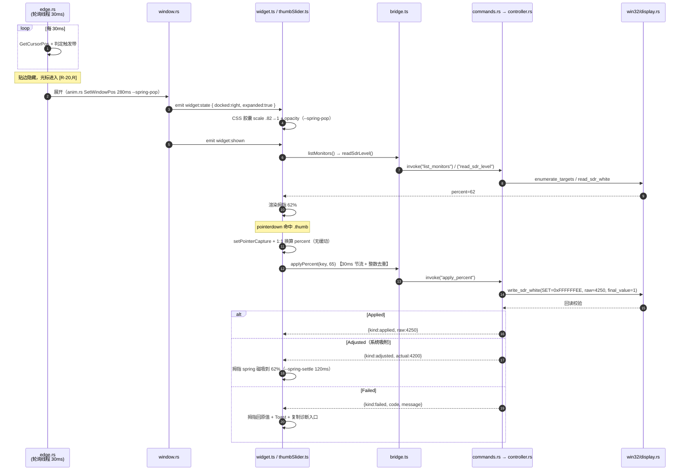
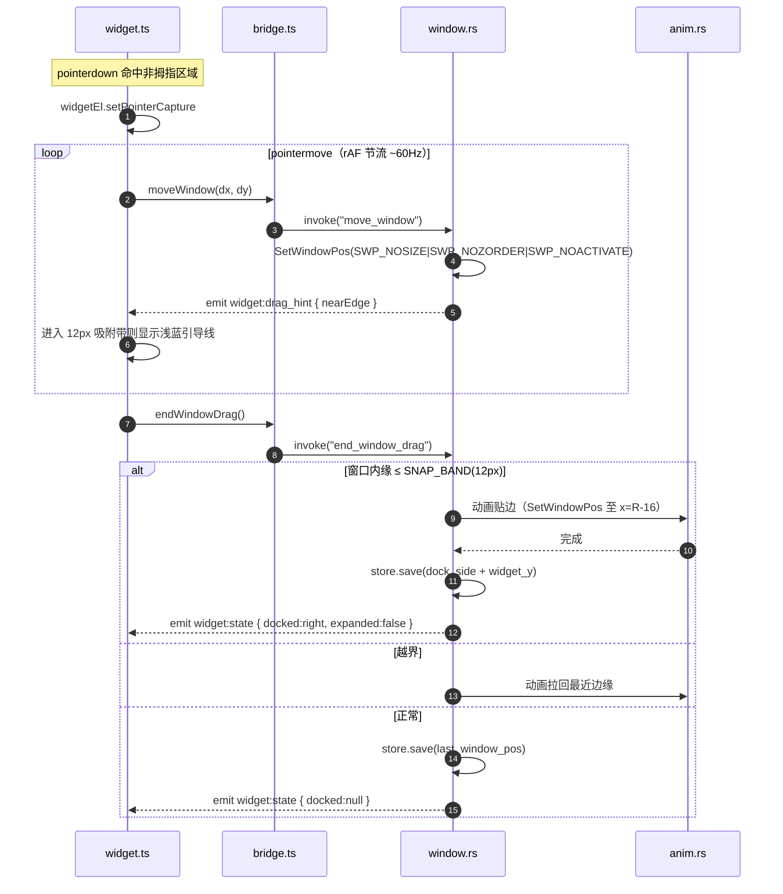
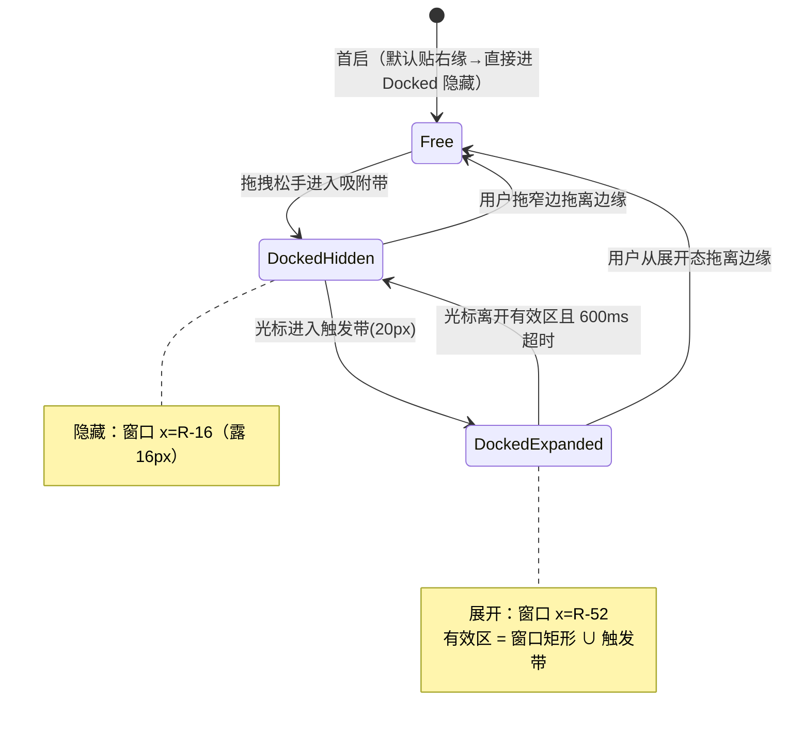
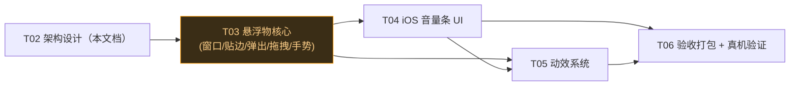

# 系统架构设计 + 任务分解：HDR SDR 控制器 v2（滑条悬浮物形态）

| 项目信息 | 内容 |
| --- | --- |
| 文档类型 | 系统架构设计 / 任务分解（**仅计划，不含实现代码**） |
| 项目名 | `hdr_sdr_widget` |
| 架构师 | 高见远（Gao） |
| PRD 依据 | `docs/hdr-sdr-widget/v2/PRD.md`（14 条 P0 + P1 全文） |
| v1 架构基线 | `docs/hdr-sdr-widget/ARCHITECTURE.md` |
| 目标平台 | Windows 11 build **26200**（25H2） |
| 目标机器 | i5-14600K / RTX 3070 / 32G / HDR 显示器 `Mi Monitor`（单屏） |
| v1 基线 | 写入链路 `SET_SDR_WHITE_LEVEL=0xFFFFFFEE, final_value=1` 真机验证通过；换算 `percent=(raw-1000)/50` 锁定；UI 已扁平化 |

---

## 0. 执行摘要（先看这段）

| 项 | 结论 |
| --- | --- |
| 技术栈 | **复用 v1：Tauri 2（Rust 后端 + WebView2 前端）+ 零框架原生 HTML/CSS/TS** |
| 一句话理由 | v1 已验证的写入链路 / 换算 / 控制器 / 托盘 / 热键 / 自启全部原样复用；v2 只重构「窗口形态 + 交互手势 + 动效」这一层，不重造底层轮子 |
| 窗口方案 | **单窗口**：滑条即悬浮物（无球），44×220 垂直胶囊透明窗口，贴左/右边缘缩入屏外露 16px |
| 5 个难点最终方案 | 见 §2（A 透明贴边窗口 / B 鼠标轮询弹出 / C 手势拆分 / D 前端拖拽+SetWindowPos / E CSS 弹簧曲线） |
| 动效方案 | **CSS transition（两枚 cubic-bezier token）+ 少量 WAAPI 补 retarget + Rust 侧窗口位移动画**，不引 JS 物理库 |
| 新增源文件 | **Rust 4 个 + 前端 4 个**，其余为修改/复用；删除 5 个 v1 面板专用文件 |
| 新增依赖 | **≈0**（无 UI 框架、无物理库、无新 crate；个别 Win32 函数若缺 feature 则手写 extern） |
| 任务总数 | **T03–T06 共 4 个里程碑 / 18 个子步骤** |
| 最大技术风险 | ① 透明窗口 + `WS_EX_NOACTIVATE` 在 WebView2 的合成与鼠标命中；② 高 DPI 缩放（真机非 100% 时几何需统一换算） |

---

## 1. 实现方案与选型

### 1.1 一句话方案

v2 在 v1 工程上**原地演进**：把「320×208 固定面板」重构为「44×220 常驻最顶层、贴边自动隐藏、鼠标靠边弹出、弹出即完整滑条可拖」的单窗口悬浮物；底层写入链路、换算、控制器、托盘、热键、自启、配置存储**全部复用 v1**，只新增/改写窗口几何、鼠标监听、手势路由与动效。

### 1.2 为什么继续用 Tauri 2 + Rust + TS（不换栈）

1. **写入链路是 v1 已验证资产**（`win32/display.rs::write_sdr_white`），换栈 = 把已验证的东西推倒重来，风险与成本均不必要。
2. **Win32 窗口样式控制是 Rust 强项**：`WS_EX_NOACTIVATE` / `WS_EX_TOOLWINDOW` / `SetWindowPos` 直接经 `windows` crate 或手写 extern 调用，掌控粒度与 v1 的 `ffi.rs`/`hotkey.rs` 完全一致。
3. **动效在 CSS 层 1:1 还原**：PRD §4.6 的两条 spring 曲线就是 `cubic-bezier`，一个 token 变量即生效，与 v1 的扁平化 CSS 资产无缝衔接。
4. **零新增依赖**：托盘/热键/自启/单实例插件 v1 已就位；前端继续零框架。

### 1.3 分层（沿用 v1，职责微调）

| 层 | 技术 | v2 职责变化 |
| --- | --- | --- |
| L1 原生层 | Rust + `windows` crate | **新增** `win32/geometry.rs`（光标位置、显示器工作区 rcWork、窗口移动）；其余 `ffi/display/dwm_fallback/registry` 原样复用 |
| L2 逻辑层 | Rust | **新增** `edge.rs`（鼠标轮询 + 贴边状态机）、`anim.rs`（spring 缓动 + 窗口位移动画）；`convert/controller/model/monitor_watch` 原样复用 |
| L3 UI 层 | HTML/CSS/TS（无框架） | **重写**为滑条悬浮物：`widget.ts`（状态机 + 手势路由）+ `thumbSlider.ts`（垂直滑块）+ `widget.css`；`bridge.ts` 增窗口移动契约 |

> 硬约束不变：L3 只经 `bridge.ts` 调 IPC，不碰任何 Win32。

---

## 2. 关键架构决策（5 个难点）

### A. 单窗口滑条：透明窗口 + 圆角 + 贴边定位（露 16px）

**最终方案**：窗口尺寸 = 胶囊尺寸（44×220 物理像素），`transparent: true` 只用于让四角透明（胶囊圆角 22px 用 CSS `border-radius` 画在满尺寸不透明 `div` 上，窗口本体无透明边距）。贴边隐藏不是缩放/裁剪内容，而是**把整个窗口用 `SetWindowPos` 平移到屏外**，只留 16px 在屏内。

**贴边坐标（以物理像素、工作区 `rcWork` 左 L / 右 R 计）**：

| 状态 | 右缘 | 左缘 |
| --- | --- | --- |
| 展开（弹出） | `x = R − 8 − 44`（内侧 8px） | `x = L + 8` |
| 隐藏（贴边） | `x = R − 16`（露 16px，28px 出屏右） | `x = L − 28`（露 16px，28px 出屏左） |
| 垂直 | `y = widget_y`，钳位 `[top+8, bottom−8−220]` | 同左 |

**关键窗口样式（不抢焦点、不进 Alt-Tab）**：
- `tauri.conf.json`：`decorations:false`、`transparent:true`、`alwaysOnTop:true`、`skipTaskbar:true`、`shadow:false`、`focus:false`、`resizable:false`。
- 启动 setup 里再叠加 `WS_EX_NOACTIVATE (0x08000000)`（点击不激活、不抢焦点）；`skipTaskbar` 已隐含 `WS_EX_TOOLWINDOW (0x80)`（不进 Alt-Tab、不进任务栏）。**绝不设 `WS_EX_APPWINDOW`**。
- 获取 HWND：`WebviewWindow::hwnd()`（Windows），再 `SetWindowLongPtrW(hwnd, GWL_EXSTYLE, old | WS_EX_NOACTIVATE)`。

**理由**：胶囊与窗口同尺寸，四角靠 `transparent` 露出圆角，无需 `SetWindowRgn`（性能好、无锯齿）；贴边 = 平移窗口，天然满足「露 16px 窄边」「弹出即完整滑条」，且窄边样式（迷你亮度指示条）由前端按 `data-docked` 属性切换渲染，无需第二窗口。

**关键 API 名**：`SetWindowPos`、`SetWindowLongPtrW`、`GWL_EXSTYLE`、`WS_EX_NOACTIVATE`、`WS_EX_TOOLWINDOW`、`WebviewWindow::hwnd()`、`Monitor::work_area()` / `GetMonitorInfoW::rcWork`。

---

### B. 鼠标靠边弹出：全局鼠标监听（轮询 vs 低级别钩子）

**最终方案**：**Rust 后台线程 `GetCursorPos` 轮询，间隔 30ms**，状态机判定触发带；**不采用** `SetWindowsHookEx(WH_MOUSE_LL)`。

**取舍**：

| 维度 | `GetCursorPos` 轮询（推荐） | `WH_MOUSE_LL` 钩子 |
| --- | --- | --- |
| 延迟 | ≤30ms（一个轮询周期） | 事件级，~0 |
| 稳定性 | 无钩子超时/卸载风险 | 回调慢会被系统强制卸载（`LowLevelHooksTimeout`） |
| 杀软敏感 | 低 | 中（全局钩子易触发启发式） |
| 复杂度 | 一个线程 + 一个循环 | 专用线程 + 消息循环 + 钩子 DLL 注入语义 |
| 与本需求匹配 | 20px 触发带 + 600ms 防抖，30ms 延迟**完全不可感知** | 延迟优势用不上 |

**理由**：触发带 20px + 600ms 收回防抖决定了「毫秒级弹出延迟」不是验收项；轮询方案与 v1 已有的后台线程模式（`monitor_watch.rs`/`hotkey.rs`）同构，可复用消息窗口/线程清理范式；无全局钩子的稳定性和杀软误报隐患。

**状态机（Rust `edge.rs`，单线程持有，`mpsc` 向业务层发事件）**：

```
Docked{edge, expanded=false}
  └─ 光标进入触发带 → expanded=true（动画展开，emit widget:state）
Docked{edge, expanded=true}
  └─ 光标离开「展开窗口矩形 ∪ 20px 触发带」→ 启动 600ms 定时器 → 超时未重入 → expanded=false（动画收缩）
Free（未贴边）
  └─ 不自动隐藏、不监听触发带；仍可拖拽
```

- 触发带（右缘）：光标 `x ∈ [R−20, R]`；左缘：`x ∈ [L, L+20]`。
- 有效区（展开后不收缩）：右缘 `x ∈ [R−52, R]`（展开窗口矩形 `[R−52,R−8]` ∪ 触发带 `[R−20,R]` 的并集）。
- 快速进出防抖：进入 → 立即展开；离开 → 启动 600ms 定时器，若期间重入则取消定时器（不回缩），否则缩回。

**关键 API 名**：`GetCursorPos`、`std::thread` + `mpsc::channel`、`thread::Builder`、事件 `widget:state`。

---

### C. 手势拆分：拖拇指调值 vs 拖其他区域移动窗口

**最终方案**：**纯 DOM 命中判定 + Pointer Capture**，在 `widget.ts` 的 `pointerdown` 上分流：

- `event.target.closest(".thumb")` 命中 → **调值手势**：`thumb.setPointerCapture(pointerId)`，`pointermove` 由 Y 坐标换算 percent，1:1 直写（无缓动），经节流调 `bridge.applyPercent`；`pointerup` 提交终值并处理 `Adjusted` 磁吸。
- 未命中拇指（图标 / 轨道空白 / 边框 / 背景 / 数字）→ **移动窗口手势**：`widgetEl.setPointerCapture(pointerId)`，`pointermove` 累加位移调 `bridge.moveWindow(dx,dy)`；`pointerup` 调 `bridge.endWindowDrag()` 触发贴边/吸附判定。

**理由**：Pointer Capture 保证「拖出窗口边界也不脱手」（P0-3 验收点）；命中判定用 `closest` 一处分支，把两种手势完全隔离，互不冒泡；「拖其余区域=移动」天然覆盖 PRD 的「图标、轨道空白、边框、背景」所有非拇指区域。

**thumb 热区**：视觉 24px 圆（拖拽中放大 28px），命中区放大到 **32×32**（含 padding 的透明热区），降低误触；轨道本身按 PRD 属于「移动窗口」区域。

**关键 API 名**：`pointerdown` / `setPointerCapture` / `pointermove` / `pointerup`、`Element.closest`、`bridge.applyPercent` / `bridge.moveWindow` / `bridge.endWindowDrag`。

---

### D. 拖拽移动窗口：Win32 实现选型

**最终方案**：**前端 mousedown + pointermove 捕获 → 位移经 `move_window` 命令 → Rust `SetWindowPos`**。**明确否决** `WM_NCLBUTTONDOWN` 假拖动（含 Tauri `window.startDragging()`）。

**三种方案取舍**：

| 方案 | 优缺点 | 判定 |
| --- | --- | --- |
| ① `WM_NCLBUTTONDOWN`+`HTCAPTION`（系统 move loop / `startDragging`） | 系统级顺滑，但：进入模态移动循环、**会激活窗口抢焦点**、无法自定义松手 spring 吸附、难以做手势拆分 | **否决**：与「不抢焦点」「自定义吸附」「手势拆分」三处硬需求冲突 |
| ② 前端 pointer 捕获 + 位移 → Rust `SetWindowPos` | 1:1 跟手、不激活窗口（`SWP_NOACTIVATE`）、松手可自由接 spring 吸附、手势拆分天然支持 | **采用** |
| ③ 纯 Rust 手动移动循环 | 绕开前端，但手势起点在 DOM，仍需前端上报，多一层往返 | 冗余，不采用 |

**实现要点**：
- `move_window(dx, dy)`：Rust 读当前 `outer_position()`，加位移后**钳位到所有显示器工作区并集**（防拖出可视区，P0-3 越界纠正），`SetWindowPos(hwnd, None, x, y, 0, 0, SWP_NOSIZE | SWP_NOZORDER | SWP_NOACTIVATE)`。
- 位移上报按 rAF 节流（≈60Hz），Tauri IPC 单次 <1ms，无性能压力。
- `end_window_drag()`：Rust 计算窗口内缘与最近屏边的距离，`≤ SNAP_BAND(12px)` → 动画贴边（进入 `Docked` 态）；否则保持 `Free` 态；越界则拉回最近边缘。随后 `store.save()` 持久化位置。
- 拖拽中由 Rust 发 `widget:drag_hint { nearEdge }`，前端据此显示「浅蓝吸附引导线」（P0-3）。

**关键 API 名**：`SetWindowPos`、`SWP_NOSIZE/SWP_NOZORDER/SWP_NOACTIVATE`、`WebviewWindow::outer_position()/set_position()`、命令 `move_window` / `end_window_drag`。

---

### E. spring 动效：CSS transition 够不够，还是 WAAPI / JS 物理

**最终方案**：**分三层，各用其长**：

| 动效 | 实现层 | 手段 | 曲线 |
| --- | --- | --- | --- |
| 弹出 / 显隐 / 悬停 / 拖拽缩放 | L3 CSS | `transition: transform/opacity` | `--spring-pop`（overshoot） |
| 贴边收缩 / 吸附 / 磁吸沉降 | L3 CSS | `transition` | `--spring-settle`（无 overshoot） |
| 窗口级贴边/弹出（窗口位移动画） | L2 Rust `anim.rs` | `SetWindowPos` 帧动画（rAF 等价：16ms tick） | 同两条曲线（采样表） |
| 数值滚动（80ms/档 + overshoot） | L3 CSS | 三位数字柱 `translateY` transition | `--spring-pop` |
| 拇指拖动 | L3 JS | 1:1 直接映射（无缓动） | 无 |
| 松手磁吸（`Adjusted`） | L3 CSS | 120ms transition | `--spring-settle` |
| 弹出中被打断需 retarget | L3 WAAPI | `element.animate()`（仅此场景） | `--spring-pop` |

**结论：CSS `cubic-bezier` transition 覆盖 90% 需求，够用且最省；WAAPI 仅补「动画中途重定目标」一个场景；不引入 JS 物理库（`rebound`/`velocity` 等）。**

**理由**：
1. PRD §4.6 明确定义的两条曲线**本身就是 cubic-bezier**，不是带速度的物理弹簧——需求没有「松手带惯性/动量」这一条（P0-8 明确「拖动 1:1 无缓动」「松手磁吸而非回弹」），故真正的物理弹簧是过度工程。
2. `transform`/`opacity` 走 GPU 合成层，60fps 零 JS 开销。
3. 唯一的「非 DOM」动效是窗口位移动画（CSS 管不到窗口坐标），由 Rust `anim.rs` 用一个 **64 点 cubic-bezier 采样表** 计算每帧 x，与 CSS 共用同一曲线参数，观感统一。
4. 弹出中断（用户快速进出）是唯一需要「取消旧动画并从当前值重算」的场景，WAAPI 的 `animation.cancel()` + `animate()` 正好覆盖，不需要整库。

**关键 API 名**：CSS `cubic-bezier(0.175,0.885,0.32,1.275)` / `cubic-bezier(0.32,0.72,0.24,1)`、`transition`、`Element.animate()`（WAAPI）、Rust `anim.rs`（bezier 采样 + tick）。

---

## 3. 文件清单

### 3.1 新增（Rust）

| # | 路径 | 层 | 一句话职责 |
| --- | --- | --- | --- |
| 1 | `src-tauri/src/win32/geometry.rs` | L1 | `GetCursorPos` / `MonitorFromPoint`+`GetMonitorInfoW`（rcWork，物理像素）/ `SetWindowPos` / `SetWindowLongPtrW` 的 safe 封装 |
| 2 | `src-tauri/src/edge.rs` | L2 | 后台鼠标轮询线程（30ms）+ 贴边状态机 + 触发带/600ms 防抖 + 发 `widget:state` |
| 3 | `src-tauri/src/anim.rs` | L2 | cubic-bezier 采样表 + `SetWindowPos` 帧动画（展开/收缩/吸附） |
| 4 | `src-tauri/src/win32/geometry.rs` 内的 `Rect` 类型与常量（并入 #1） | L1 | — |

### 3.2 修改（Rust）

| # | 路径 | 变化 |
| --- | --- | --- |
| 5 | `src-tauri/src/window.rs` | **重写**：从「面板定位/显隐」改为「悬浮物几何 + 贴边/拖拽编排 + 位置记忆 + 越界纠正」 |
| 6 | `src-tauri/src/commands.rs` | 新增 `move_window` / `end_window_drag` / `get_widget_state`；新增事件 emit（`widget:state` / `widget:drag_hint` / `widget:shown`） |
| 7 | `src-tauri/src/store/settings.rs` | 新增 `dock_side`（`left`/`right`/`null`）、`widget_y`；版本 v2 + 迁移 |
| 8 | `src-tauri/src/tray.rs` | 菜单项改为「显示/隐藏滑条、三档预设（白天/观影/夜间）、设置、退出」 |
| 9 | `src-tauri/src/main.rs` | 注册 `widget` 窗口；setup 启动 `edge` 线程 + 应用 `WS_EX_NOACTIVATE` |
| 10 | `src-tauri/tauri.conf.json` | 窗口 44×220、`transparent`、`alwaysOnTop`、`skipTaskbar`、`shadow:false`、`focus:false`、`resizable:false` |

> `win32/ffi.rs` **基本无需改动**：`windows` crate 的 `Win32_UI_WindowsAndMessaging` / `Win32_Graphics_Gdi` feature（v1 已启用）已含 `SetWindowPos` / `GetCursorPos` / `MonitorFromPoint` / `GetMonitorInfoW`；若个别符号缺 feature，则按 v1 惯例在 `geometry.rs` 手写 extern，不新增 crate。

### 3.3 新增（前端）

| # | 路径 | 职责 |
| --- | --- | --- |
| 11 | `src/ui/widget.ts` | 悬浮物主状态机（默认/悬停/拖拽移动/docked-hidden/弹出/HDR 关闭）+ 手势路由（C） |
| 12 | `src/ui/thumbSlider.ts` | 垂直滑块：拇指 1:1 拖调值 + 节流写入 + 磁吸 + 数值滚动（P0-7/8/9） |
| 13 | `src/styles/widget.css` | 胶囊、窄边（迷你指示条）、轨道、拇指、数字滚动、状态类 |

### 3.4 修改（前端）

| # | 路径 | 变化 |
| --- | --- | --- |
| 14 | `src/bridge.ts` | 新增 `moveWindow` / `endWindowDrag` / `getWidgetState` + `onWidgetState` / `onDragHint` / `onWidgetShown`；复用读写命令 |
| 15 | `src/main.ts` | 重写为装配 `widget.ts` + 订阅事件 |
| 16 | `src/index.html` | 根容器改滑条（`<div id="app">` 不变，语义调整） |
| 17 | `src/styles/tokens.css` | 重写：尺寸 44×220/圆角 22、PRD §4.5 色值、§4.6 动效 token |
| 18 | `src/ui/icons.ts` | 复用（sun/warning/preset 图标已具备），按需补窄边指示 |
| 19 | `src/ui/toast.ts` | 复用/微调（贴滑条定位） |
| 20 | `src/ui/presets.ts` | 改为「长按呼出三档」弹层（复用 `applyPreset`） |

### 3.5 删除（v1 面板专用，v2 单窗口不再需要）

| # | 路径 | 说明 |
| --- | --- | --- |
| 21 | `src/ui/panel.ts` | 被 `widget.ts` 取代 |
| 22 | `src/ui/monitorSelect.ts` | 多显示器下拉 → 下放 P2 |
| 23 | `src/ui/slider.ts` | 被 `thumbSlider.ts` 取代（精确输入下放 P2） |
| 24 | `src/styles/panel.css` | 被 `widget.css` 取代 |
| 25 | `src/styles/controls.css` | 合并进 `widget.css` |
| 26 | `src/styles/slider.css` | 合并进 `widget.css` |

> **复用不动**：`win32/ffi.rs`、`win32/display.rs`、`win32/dwm_fallback.rs`、`win32/mod.rs`、`core/model.rs`、`core/convert.rs`、`core/controller.rs`、`core/monitor_watch.rs`、`core/registry.rs`、`error.rs`、`hotkey.rs`、`autostart.rs`、`bin/probe.rs`。

---

## 4. 数据结构与接口

### 4.1 Rust：几何常量（`win32/geometry.rs`，物理像素）

```rust
pub const WIDGET_W: i32 = 44;
pub const WIDGET_H: i32 = 220;
pub const WIDGET_RADIUS: i32 = 22;
pub const EDGE_REVEAL: i32 = 16;   // 贴边露出宽度
pub const TRIGGER_BAND: i32 = 20;  // 触发带宽度
pub const EDGE_INSET: i32 = 8;     // 展开时距屏边内边距
pub const SNAP_BAND: i32 = 12;     // 松手吸附带
pub const CURSOR_POLL_MS: u64 = 30;
pub const RETRACT_DELAY_MS: u64 = 600;
pub const DOCK_ANIM_MS: u64 = 280;

#[derive(Clone, Copy, PartialEq, Eq)]
pub struct Rect { pub left: i32, pub top: i32, pub right: i32, pub bottom: i32 }

pub fn cursor_pos() -> Option<(i32, i32)>;                       // GetCursorPos
pub fn monitor_work_area(x: i32, y: i32) -> Option<Rect>;        // MonitorFromPoint + GetMonitorInfoW.rcWork
pub fn primary_work_area() -> Option<Rect>;
pub fn set_window_pos(hwnd: HWND, x: i32, y: i32, no_activate: bool);
pub fn apply_no_activate(hwnd: HWND);                            // SetWindowLongPtrW 叠加 WS_EX_NOACTIVATE
```

### 4.2 Rust：状态与命令（`edge.rs` / `window.rs` / `commands.rs`）

```rust
// edge.rs
#[derive(Clone, Copy, PartialEq, Eq, Serialize)]
#[serde(rename_all = "lowercase")]
pub enum Edge { Left, Right }

#[derive(Clone, Copy, PartialEq, Eq, Serialize)]
#[serde(rename_all = "camelCase")]
pub struct WidgetState {
    pub docked: Option<Edge>,   // null = Free
    pub expanded: bool,
}

// commands.rs 新增（与 bridge.ts 一一对应）
#[tauri::command] fn move_window(app: AppHandle, dx: i32, dy: i32) -> Result<(), CommandError>;
#[tauri::command] fn end_window_drag(app: AppHandle, state: State<AppState>) -> Result<(), CommandError>;
#[tauri::command] fn get_widget_state(state: State<AppState>) -> WidgetState;

// 事件（app.emit）
// "widget:state"     -> WidgetState           （贴边/展开变化，前端切渲染态）
// "widget:drag_hint" -> { nearEdge: Option<Edge> }  （拖拽中吸附引导线）
// "widget:shown"     -> ()                    （展开完成，前端强制 refresh 读数，对齐 v1 panel:shown）
```

### 4.3 配置持久化（`store/settings.rs`，v2 迁移）

```jsonc
// %APPDATA%\hdr-sdr-widget\settings.json  （新增字段）
{
  "version": 2,
  // ...v1 既有字段全保留...
  "dock_side": null,        // "left" | "right" | null（null=自由悬浮，记忆 last_window_pos）
  "widget_y": 220,          // 贴边时的垂直位置（物理像素），首启默认 220
  "hotkey": ""              // v2 热键默认关：空串=禁用（注册前判空跳过）
}
```

- 迁移：v1 → v2 时 `dock_side` 默认 `null`、`widget_y` 默认 220；`first_run` 首启默认贴右缘（P1-2）。
- 位置记忆语义：`Free` 态记 `last_window_pos`；贴边态记 `dock_side + widget_y`。

### 4.4 前端 bridge 契约（`bridge.ts` 新增）

```ts
export type Edge = "left" | "right";
export interface WidgetState { docked: Edge | null; expanded: boolean; }
export interface DragHint { nearEdge: Edge | null; }

export function moveWindow(dx: number, dy: number): Promise<void>;   // invoke("move_window", { dx, dy })
export function endWindowDrag(): Promise<void>;                      // invoke("end_window_drag")
export function getWidgetState(): Promise<WidgetState>;              // invoke("get_widget_state")
export function onWidgetState(cb: (s: WidgetState) => void): Promise<() => void>;
export function onDragHint(cb: (h: DragHint) => void): Promise<() => void>;
export function onWidgetShown(cb: () => void): Promise<() => void>;
// 复用：listMonitors / readSdrLevel / applyPercent / applyPreset / getSettings / saveSettings / openHdrSettings / getDiagnostics
```

---

## 5. 程序调用流程（mermaid）

### 5.1 鼠标靠边弹出 → 拖拇指调值 → 写入



### 5.2 拖拽移动窗口 → 松手贴边



### 5.3 贴边隐藏 → 触发带弹出 → 移出防抖缩回（状态机）



---

## 6. 实现任务列表（T03–T06）

> 依赖关系：T03（核心）→ T04（UI）→ T05（动效）→ T06（验收）。T04/T05 的部分 CSS/图标可在 T03 期间按 §4 契约并行。T02 架构（本文档）为前置。

### T03 — 滑条悬浮物核心（窗口/贴边/弹出/拖拽/手势）

| 项 | 内容 |
| --- | --- |
| 依赖 | T02（本文档） |
| 优先级 | P0 |
| 涉及文件 | `tauri.conf.json`、`win32/geometry.rs`、`edge.rs`、`anim.rs`、`window.rs`、`commands.rs`、`main.rs`、`bridge.ts`、`widget.ts`（骨架） |

| 子步骤 | 内容 | 产出/判据 |
| --- | --- | --- |
| S3.1 | `tauri.conf.json`：窗口 44×220、`decorations:false`、`transparent:true`、`alwaysOnTop:true`、`skipTaskbar:true`、`shadow:false`、`focus:false`、`resizable:false`；`main.rs` 应用 `WS_EX_NOACTIVATE` | 窗口常驻最顶、点击不抢焦点、不进 Alt-Tab |
| S3.2 | `win32/geometry.rs`：`GetCursorPos`/`MonitorFromPoint`+`GetMonitorInfoW.rcWork`/`SetWindowPos`/`SetWindowLongPtrW` 封装 + 常量表（§4.1） | 单元测试：矩形/坐标换算正确 |
| S3.3 | `anim.rs`：cubic-bezier 采样表 + `SetWindowPos` 帧动画（展开/收缩/吸附，280ms） | 贴边/展开窗口滑动无跳变 |
| S3.4 | `edge.rs`：30ms 轮询线程 + 状态机（§2B）+ 600ms 防抖 + 发 `widget:state` | 靠边稳定弹出、移出 600ms 后缩回、快速进出不抖动 |
| S3.5 | `window.rs` 重写：`move_window`（钳位）/ `end_window_drag`（贴边判定 + 持久化 + 越界纠正） | 拖动 1:1 跟手；松手贴边/自由落位正确；重启位置恢复 |
| S3.6 | `commands.rs`：新增三命令 + 三事件；`main.rs` setup 启动 edge 线程 | `bridge.ts` 契约对齐；事件可被前端订阅 |
| S3.7 | `widget.ts` 手势路由骨架：`pointerdown` 命中 `.thumb` 分流（§2C）+ Pointer Capture | 拖拇指 vs 拖窗口互不干扰，拖出窗口不脱手 |

**验收**：① 无焦点抢占、不进 Alt-Tab；② 贴边露 16px、弹出完整滑条；③ 拖拽跟手 + 松手吸附；④ 触发带弹出/防抖缩回稳定。

### T04 — iOS 音量条 UI

| 项 | 内容 |
| --- | --- |
| 依赖 | T03（窗口 + 契约） |
| 优先级 | P0（视觉为第一验收项） |
| 涉及文件 | `tokens.css`、`widget.css`、`widget.ts`、`thumbSlider.ts`、`icons.ts`、`toast.ts`、`index.html`、`main.ts` |

| 子步骤 | 内容 | 产出/判据 |
| --- | --- | --- |
| S4.1 | `tokens.css` 重写：尺寸 44×220/圆角 22 + PRD §4.5 色值 + §4.6 动效 token | 变量与 PRD 表 1:1；无裸值 |
| S4.2 | `widget.css`：胶囊、窄边（4px 迷你指示条）、轨道（4px 圆头）、拇指（24px，拖拽 28px）、1px 细描边 | 视觉走查通过；无渐变/多层阴影/emoji |
| S4.3 | `thumbSlider.ts`：垂直滑块（底 0% → 顶 100%）、1:1 拖调值、30ms 节流写入、`Adjusted` 磁吸、`Failed` 回弹+Toast | 拖动 60fps；松手不回弹不跳动 |
| S4.4 | `widget.ts` 状态机渲染：默认/悬停（scale 1.04）/拖拽移动（1.08+蓝描边）/docked-hidden/弹出/HDR 关闭 | 各态切换正确；HDR 关闭 → 橙色警告 + 禁用 + 前往设置 |
| S4.5 | 数值滚动：三位数字柱 80ms/档 + `--spring-pop` overshoot | 数值与拇指同步，无闪烁/截断 |
| S4.6 | `presets.ts` 改长按呼出三档（白天 80/观影 60/夜间 30）+ Toast 定位 | 长按呼出、一键写入生效、值持久化 |

**验收**：视觉/动效按 PRD §4 逐条走查；`grep` 零 emoji、零 `gradient`；全链路无 TODO/占位符。

### T05 — 动效系统

| 项 | 内容 |
| --- | --- |
| 依赖 | T03、T04 |
| 优先级 | P0 |
| 涉及文件 | `tokens.css`、`widget.css`、`anim.rs`、`widget.ts` |

| 子步骤 | 内容 | 产出/判据 |
| --- | --- | --- |
| S5.1 | 窗口级 spring：`anim.rs` 对接贴边/展开/吸附，曲线与 CSS 同参 | 窗口滑动与内容缩放观感统一 |
| S5.2 | 内容级 spring：CSS transition 全覆盖；WAAPI 仅补弹出中断 retarget | 无生硬/线性动画 |
| S5.3 | 跟手与磁吸：拇指 1:1（无缓动）+ 松手磁吸（`--spring-settle` 120ms） | 拖动零延迟；磁吸不跳变 |
| S5.4 | 动效 token 统一走查（两曲线一处定义，禁裸值） | `--spring-pop` / `--spring-settle` 唯一来源 |

**验收**：所有显隐/弹出/收缩/吸附动画带物理反馈、非线性、60fps。

### T06 — 验收打包 + 真机验证

| 项 | 内容 |
| --- | --- |
| 依赖 | T03、T04、T05 |
| 优先级 | P0 |
| 涉及文件 | `scripts/build.ps1`、`tauri.conf.json`（打包段）、`docs/hdr-sdr-widget/v2/VERIFICATION.md`、`icons/*` |

| 子步骤 | 内容 | 产出/判据 |
| --- | --- | --- |
| S6.1 | 真机验证：贴边/弹出/拖拽/调值/吸附/HDR 关闭降级/写入失败兜底/重启位置记忆，逐条记录 | `VERIFICATION.md` 全 ✅（含截图） |
| S6.2 | `npm run tauri build` 出 NSIS 安装包 | 安装包 <10MB，可装/可卸 |
| S6.3 | 干净环境回归：卸载重装 → 首启贴右缘 → 托盘常驻 → 调节生效 | 无残留、无报错 |

**验收**：P0 全 14 条 + P1-1/2/3/4 达标；安装后常驻内存 <80MB；卸载无残留自启项。

### 6.1 任务依赖图



> **关键路径：T03 → T04 → T05 → T06**。T03 是最高风险（透明窗口 + 鼠标监听 + 手势拆分），先打穿。

---

## 7. 依赖包列表

### 7.1 结论：无新增依赖

v2 完全复用 v1 依赖树，不引入任何新 crate 或 npm 包。

### 7.2 Rust（`Cargo.toml`，不变）

| crate | 用途（v2 沿用） |
| --- | --- |
| `tauri`（`tray-icon`） | 窗口 + 托盘 |
| `tauri-plugin-opener` / `single-instance` | 跳系统设置 / 单实例 |
| `serde` / `serde_json` | 序列化 |
| `thiserror` / `once_cell` | 错误 / 单例 |
| `windows`（features 见 v1） | `SetWindowPos` / `GetCursorPos` / `MonitorFromPoint` / `GetMonitorInfoW` 等 |

> 注：`GetCursorPos` / `MonitorFromPoint` / `GetMonitorInfoW` / `SetWindowPos` 均在 v1 已启用的 `Win32_UI_WindowsAndMessaging` / `Win32_Graphics_Gdi` feature 内。若编译时发现个别符号缺失，按 v1 惯例在 `win32/geometry.rs` 手写 extern，**不追加 feature、不加 crate**。

### 7.3 前端（`package.json`，不变）

| 包 | 用途 |
| --- | --- |
| `@tauri-apps/api` | IPC 客户端 |
| `typescript` / `vite` / `@tauri-apps/cli` | 构建 |

> **无 UI 框架、无 spring 物理库**（决策 E）。WAAPI 为浏览器原生能力，零依赖。

---

## 8. 共享知识（跨文件约定）

### 8.1 坐标与 DPI

- **统一物理像素**作为窗口几何唯一基准：`SetWindowPos` / `outer_position()` / `Monitor::work_area()` / `rcWork` 一律物理像素；设计值 44 / 220 / 16 / 20 / 8 / 12 / 22 均为物理像素（与 v1 现状一致，v1 假定 100% 缩放）。
- **DPI 换算点**：若真机 scale ≠ 100%，在 `geometry.rs` 提供一个 `logical_to_physical(v, monitor)` 帮助函数，把上述「逻辑设计值」统一乘以 `scale_factor`；**只在这一处换算**，其余模块不得各自乘。
- 窗口坐标原点 = 主显示器左上角（Windows 虚拟屏坐标系），多屏可为负。

### 8.2 窗口句柄与样式

- HWND 获取：`WebviewWindow::hwnd()`（仅 Windows）；`edge.rs`/`anim.rs` 通过 `AppHandle` 或启动时缓存的 `HWND` 访问。
- 目标样式：`WS_POPUP`（无标题栏，Tauri `decorations:false` 已设）+ `WS_EX_TOOLWINDOW`（`skipTaskbar` 已设）+ `WS_EX_NOACTIVATE`（setup 手动叠加）+ `WS_EX_LAYERED`（`transparent` 已设）。**禁止 `WS_EX_APPWINDOW`**。

### 8.3 颜色 token（PRD §4.5）

| Token | 值 |
| --- | --- |
| `--widget-bg` | `#1C1C1E` |
| `--widget-border` | `rgba(255,255,255,0.10)`（hover 0.20 / drag `#0A84FF`） |
| `--text-primary` | `#F5F5F7` |
| `--text-secondary` | `rgba(235,235,245,0.60)` |
| `--accent` | `#0A84FF`（已填充轨道 / 拖拽描边 / 窄边指示） |
| `--warning` | `#FF9F0A`（HDR 未开启 / 窄边异常） |
| `--track-idle` | `rgba(120,120,128,0.32)` |
| `--thumb` | `#FFFFFF` |

### 8.4 动效 token（PRD §4.6）

| Token | 值 | 用途 |
| --- | --- | --- |
| `--spring-pop` | `cubic-bezier(0.175, 0.885, 0.32, 1.275)` | 弹出 / 显隐 / 数值滚动末尾 |
| `--spring-settle` | `cubic-bezier(0.32, 0.72, 0.24, 1)` | 贴边收缩 / 吸附 / 磁吸 |
| 时长 | 展开 280ms / 磁吸 120ms / 滚动 80ms/档 / 收回延迟 600ms | — |

> `anim.rs` 的 bezier 采样表**必须与上述两组参数逐字一致**，共用一套常量（写在一个可被 Rust 与文档引用处）。

### 8.5 事件与状态机约定

- 事件命名：`widget:state` / `widget:drag_hint` / `widget:shown`（对齐 v1 `panel:shown` / `monitors:changed` / `toast:show` 的 `域:名` 风格）。
- 状态机唯一真源在 `edge.rs`；前端 `data-state` 仅作渲染镜像，不反推逻辑。
- 读/写复用 v1 语义：内部真值 = 整数 `percent`；写前 `rebind` 稳定键；写后回读校验。

### 8.6 禁止项（用户硬性约束）

- 扁平化、单色 SVG（1.6px stroke / round cap）、深色主题、**禁 emoji**、禁渐变、禁多层阴影。
- 禁占位符 / TODO / 假数据。
- 窗口不抢焦点、不进 Alt-Tab（§2A 样式）。

---

## 9. 待明确事项

| # | 事项 | 影响 | 建议默认 / 处置 |
| --- | --- | --- | --- |
| U1 | **真机 scale 是否为 100%**（Mi Monitor 的 DPI 缩放） | 决定 §8.1 是否需启用 DPI 换算路径 | 架构已留 `logical_to_physical` 单点；T03-S3.2 实测确认，非 100% 则启用 |
| U2 | **`WS_EX_NOACTIVATE` 对 WebView2 的鼠标命中/合成**（透明窗口在 26200 上是否闪烁，v1 已知 R7） | 若闪烁/命中异常，需回退 `windowEffects` 或关透明 | 复用 v1 R7 结论；T03-S3.1 目视验证 |
| U3 | **长按呼出三档预设的阈值与菜单位置** | P1-5 交互细节 | 默认长按 500ms、在滑条旁弹出竖排三档；可在实现中微调 |
| U4 | **热键默认关的实现** | P1-3 | `settings.hotkey` 空串 = 禁用；`hotkey::reload` 判空跳过注册 |
| U5 | **窄边指示条（4px 竖条）的精确视觉与异常橙色** | P0-4/P0-11 | 正常 `#0A84FF` / 异常 `#FF9F0A`，长度映射 0–100% |
| U6 | **多屏（P2-3）不实现**，贴边只贴当前所在屏 | 影响坐标计算范围 | 按单屏 rcWork 实现；`enumerate` 已按 N 台写，多屏后续零成本加 |
| U7 | **透明窗口是否阻塞其覆盖区域的点击**（窗口矩形内但胶囊外的透明像素） | 若阻塞则影响贴边窄边以外的交互 | 本形态窗口=胶囊尺寸，无透明边距，理论上无此问题；T03 实测确认 |
| U8 | **自由悬浮态是否也参与「鼠标靠边弹出」** | 状态机边界 | 已定：仅 `Docked` 态监听触发带，`Free` 态常驻显示（PRD §4.4） |

---

## 附录 A：PRD ↔ 架构映射（确保无遗漏）

| PRD | 落点 |
| --- | --- |
| P0-1 单窗口胶囊 | `tauri.conf.json` + `main.rs`（WS_EX_NOACTIVATE）+ `widget.css` |
| P0-2 扁平视觉 | `tokens.css` / `widget.css` / `icons.ts`（零 emoji） |
| P0-3 拖拽移动 + spring 吸附 | `widget.ts`（手势）+ `window.rs`（SetWindowPos + 贴边判定）+ `anim.rs` |
| P0-4 贴边自动隐藏 | `window.rs` + `edge.rs`（露 16px） |
| P0-5 鼠标靠边弹出 | `edge.rs`（触发带 + 600ms 防抖） |
| P0-6 弹出即调值 | `widget.ts`（展开即完整滑条）+ `thumbSlider.ts` |
| P0-7 亮度生效 | 复用 `controller.rs` / `display.rs::write_sdr_white` / `convert.rs` |
| P0-8 拇指跟手 + 阻尼回弹 | `thumbSlider.ts`（1:1 + 磁吸） |
| P0-9 数值滚动 | `widget.css`（三位数字柱 80ms/档） |
| P0-10 读取 + 双向同步 | 复用 `controller.refresh` + `monitor_watch.rs` + `widget:shown` 强制刷新 |
| P0-11 HDR 未开启降级 | `widget.ts`（HDR 关闭态）+ 复用 `read_advanced_color` |
| P0-12 写入失败兜底 | 复用 `error.rs` + `toast.ts` + `get_diagnostics` |
| P0-13 动效统一 spring | `tokens.css` + `anim.rs` |
| P0-14 全扁平视觉 | 同 P0-2 |
| P1-1 托盘 | 复用 `tray.rs`（菜单微调） |
| P1-2 贴边位置记忆 | `store/settings.rs`（dock_side + widget_y） |
| P1-3 热键（默认关） | 复用 `hotkey.rs`（空串禁用） |
| P1-4 自启（默认关） | 复用 `autostart.rs` |
| P1-5 预设长按呼出 | `presets.ts`（长按弹层）+ 复用 `apply_preset` |
| P1-6 步进微调 | 可选，`thumbSlider.ts` 预留 |
